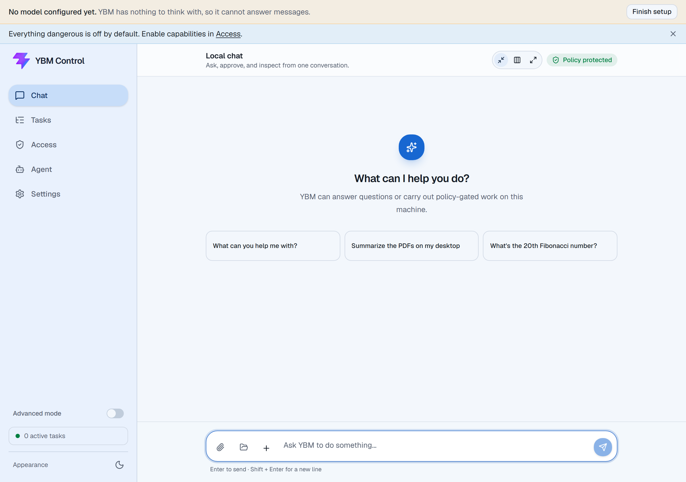

# YBM Control

```
You:  organize my Downloads folder by file type, then tell me what you moved
YBM:  Sorted 41 files into 6 folders (Images, Documents, Archives, Installers,
      Code, Other). Nothing was deleted. Full list and every file path touched
      are in this task's trace.
```

That's the shape of it: real access to your machine — filesystem, terminal, browser, VS Code, a
scheduler, MCP tools, even desktop control — through Telegram, WhatsApp, or a built-in web chat, with every
capability **disabled by default**.

Bring your own model. **Anthropic (Claude), OpenAI, Google Gemini, OpenRouter, Groq, DeepSeek,
Mistral, xAI, and Together** work with an API key, and **Ollama, LM Studio, or LocalDeploy** run
a model on your own hardware for free with nothing leaving the machine. Setup verifies the key
and makes one real call before saving, so a model that cannot answer never becomes your default.
Voice messages work too, in the console and on Telegram — recordings are transcribed locally. Dangerous operations require an explicit, one-shot, expiring
approval that the runtime enforces — not the model, not a config flag, and not bypassable by an
"allow everything" mode. Every request, approval, and result is logged, and every task has a full
trace you can open and check.



## Why YBM Control

Most self-hosted agent frameworks ask you to trust the model. YBM Control is built around the
assumption that you shouldn't have to.

| | |
|---|---|
| **Approvals the model can't bypass** | High-impact operations (running generated code, creating a schedule, installing an MCP server, ...) are gated at the runtime level — `ToolDefinition.approval_required_operations` — independent of any access-mode preset, including "Full Access." The model setting `approved: true` in its own output has no effect. |
| **Secure by default, not secure-if-configured** | Terminal execution, filesystem access, browser automation, desktop control, dependency installs, and git push all start **off**. A capability policy engine with per-capability risk ceilings and a global approval floor sits in front of every tool call. |
| **A real audit trail** | Every tool request, policy decision, and approval is a structured, redacted audit event. Configured secrets are redacted at logging and response boundaries, and vault-backed tools inject them without intentionally exposing their values — redaction is a real safeguard, not a substitute for keeping secrets out of prompts and outputs (see [docs/THREAT_MODEL.md](docs/THREAT_MODEL.md)). |
| **Tested against recorded reality, not mocks** | 30+ deterministic scenario tests replay real, previously-recorded LLM responses through the actual worker/policy/executor stack — no network calls, no flake, no API cost, and they catch real regressions (see [docs/HISTORY.md](docs/HISTORY.md) for examples). |
| **A published threat model** | [docs/THREAT_MODEL.md](docs/THREAT_MODEL.md) states trust boundaries and known limitations up front, instead of implying there are none. |

This is a smaller, younger project than the large general-purpose agent frameworks in this space.
What it's built to do well is the governance layer: give an agent real capability without giving
up visibility or control over what it just did.

## Quickstart

**Nothing needs to be installed first — not git, not Python.** The installer brings its own:
`uv` is a standalone binary, and it downloads the Python YBM runs on.

Once you have the folder, double-click **`YBM-Setup.cmd`** (Windows). No terminal, no commands
to paste. It installs whatever is missing and opens the console.

<details>
<summary>Prefer a terminal, or on Linux/macOS?</summary>

```bash
# Linux/macOS, from inside the folder
./scripts/install.sh
```
```powershell
# Windows, from inside the folder
powershell -ExecutionPolicy Bypass -File .\scripts\install.ps1
```

Useful flags on both: `--dry-run` shows what would happen and changes nothing, `--verify` proves
the install works before returning, `--install-dir DIR` picks the location.

</details>

> **Prefer a one-liner?** Once you have the repository, the setup file above is the
> shortest path. If you would rather not clone first, `install.sh` and `install.ps1`
> can be piped straight from a checkout of this repo.

The installer sets up dependencies, writes your config and tokens, and starts the stack. The
model and Telegram choices happen in the browser wizard that opens — Telegram is optional, since
the built-in web chat needs no setup.

After that, double-click **`YBM.bat`** — installs anything new, checks for an update, and opens
the console. Running it again when everything's current just starts the console.

Already have it running? Talk to it at `http://127.0.0.1:8765/admin`.

## What it can do

Filesystem search/organize inside allowed roots, terminal-run coding via Codex/Claude
Code/Copilot CLI or a bounded local/Docker Python interpreter, Chrome browser automation, VS Code
bridge, desktop screenshot/control (Windows), scheduled recurring tasks, MCP client/server, PDF
and document generation, per-task LLM cost tracking, parallel tool calls and sub-agent
delegation, a persona/preferences layer, and local keyword search over your own documents — all
through Telegram, WhatsApp, or the local web chat, all policy-gated.

Structured memory (facts with a category, confidence, and provenance — did the agent save it
itself mid-task, or did you type it into the console — remember/edit/forget from a dedicated
Memory page) and a skill catalog (install/uninstall from the console, with an informational tag
showing which tools a skill's instructions reference — not an enforced permission) round out the
admin console alongside Access, Tasks, and Chat.

WhatsApp is a second channel alongside Telegram (via [Baileys](https://github.com/WhiskeySockets/Baileys),
an unofficial client — no Meta developer account or public webhook required). It's disabled by
default and requires linking your own number by scanning a QR code; see
[docs/LOCAL_SETUP.md](docs/LOCAL_SETUP.md#5-link-whatsapp-optional). v1 is plain text only — no
buttons, voice, or file delivery yet, unlike Telegram.

See [docs/CAPABILITIES.md](docs/CAPABILITIES.md) for the full, detailed list and
[docs/ARCHITECTURE.md](docs/ARCHITECTURE.md) for how the pieces fit together.

## Development

Cross-platform, once installed:

```bash
ybm doctor            # check the environment
ybm start             # start the stack
ybm status            # what's running
ybm logs worker -f    # follow one service's log
ybm stop              # stop everything
```

Windows also has the original, equally-supported `scripts\ybm.ps1` interface (`run`, `setup`,
`doctor`, `start`, `stop`, `status`, `logs`, `test`, `db`, `config`, `clean`, `trace`, `scenario`,
`package-extension`, `tray`, `autostart`, `backup`, `check-updates`, and more — run
`.\scripts\ybm.ps1 help` for the full list). `ybm autostart enable` puts a system tray icon
(Open Admin Console / Start / Stop / Restart / Status) in your Startup folder so it launches at
login — no terminal needed after that one command.

The admin console is a React app (`frontend/`) served by the backend at `/admin` — see
[docs/UI_REWRITE_PLAN.md](docs/UI_REWRITE_PLAN.md) for its design and phase-by-phase build record.
`ybm ui-dev` runs it with hot reload against a running backend; `ybm ui-build` builds it into
`backend/src/agent_control/static/admin/`, served directly at `/admin` once built.

Run tests:

```bash
cd backend && uv run --frozen pytest
```

`backend/tests/scenario/` is a fast, deterministic tier: the real worker/registry/policy/executor
stack against a temp filesystem, with recorded LLM responses replayed from
`backend/tests/scenario/fixtures/` — no network, no GPU, no API spend, included in the run above.
When a change alters a prompt, a tool's schema, or the workspace layout, affected fixtures fail
loudly instead of silently replaying stale data; re-record just those with
`.\scripts\ybm.ps1 scenario record <name>` (makes real LLM calls — free against a local profile,
review the regenerated fixture before committing).

See [CONTRIBUTING.md](CONTRIBUTING.md) for the full development workflow, and
[docs/LOCAL_SETUP.md](docs/LOCAL_SETUP.md) for manual (non-wizard) setup and every configurable
runtime detail.

## Docs

- [Architecture and message flow](docs/ARCHITECTURE.md) — how the system works now, plus known gaps
- [Capabilities](docs/CAPABILITIES.md) — the full implemented/not-yet-implemented list
- [UI rewrite plan](docs/UI_REWRITE_PLAN.md) — the React admin console's design and build record
- [UI/UX audit and roadmap](docs/UI_UX_AUDIT.md) — current feature coverage, competitive review, gaps, and phased improvements
- [Threat model](docs/THREAT_MODEL.md) — trust boundaries, enforced controls, limitations
- [Security policy](SECURITY.md) — supported versions and private vulnerability reporting
- [Contributing](CONTRIBUTING.md)
- [History](docs/HISTORY.md) — why it's built this way, and the full phase-by-phase record
- [Local setup](docs/LOCAL_SETUP.md)
- [Minimal end-to-end test](docs/MINIMAL_END_TO_END_TEST.md)
- [Database inspection](docs/DATABASE_INSPECTION.md)

## Safety Defaults

The example config disables terminal execution, filesystem access, VS Code access, desktop
screenshots, desktop control, computer use, browser automation, dependency installation, and Git
pushes.

YBM Control is intended for one trusted operator on a local machine. Keep the backend, admin UI, VS Code
bridge, model endpoints, and generated preview servers bound to loopback. It is not designed as
an Internet-facing or multi-tenant control plane.

Tool and memory content is untrusted data, including web pages, documents, HTTP bodies, MCP
results, generated code, and prior summaries. Runtime tool definitions enforce capability and
minimum operation risk; the global approval floor remains active even when a capability does not
otherwise require approval. Persistent and critical operations use exact, expiring, one-shot
approvals. Access-mode presets, including Full Access, do not fabricate or bypass those
approvals.

Review the exact tool parameters before approving. Keep `.env`, `config/config.yaml`,
`agent_control.db`, logs, screenshots, generated workspaces, and `.agent_control/` private. See
the [threat model](docs/THREAT_MODEL.md) before enabling high-impact capabilities or changing
repository visibility.

## License

[MIT](LICENSE)
