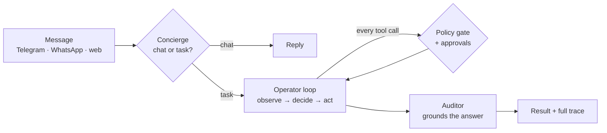

# YBM Control

```
You:  organize my Downloads folder by file type, then tell me what you moved
YBM:  Sorted 41 files into 6 folders (Images, Documents, Archives, Installers,
      Code, Other). Nothing was deleted. Full list and every file path touched
      are in this task's trace.
```

Real access to your machine — filesystem, terminal, browser, VS Code, a scheduler, MCP tools,
desktop control — through Telegram, WhatsApp, or a built-in web chat, with **every capability
disabled by default**. Dangerous operations need an explicit, one-shot, expiring approval that the
*runtime* enforces: not the model, not a config flag, and not bypassable by an "allow everything"
mode.

## Why

Most self-hosted agent frameworks ask you to trust the model. YBM assumes you shouldn't have to.

| | |
|---|---|
| **Approvals the model can't bypass** | High-impact operations are gated at the runtime level — `ToolDefinition.approval_required_operations` — independent of any access-mode preset, including "Full Access". A model setting `approved: true` in its own output has no effect. |
| **Secure by default** | Terminal, filesystem, browser, desktop, dependency installs, and Git push all start **off**. A policy engine with per-capability risk ceilings and a global approval floor sits in front of every tool call. |
| **A real audit trail** | Every tool request, policy decision, and approval is a structured, redacted audit event. Every task has a full trace you can open and check. |
| **Tested against recorded reality** | 30+ deterministic scenario tests replay real recorded LLM responses through the actual worker/policy/executor stack — no network, no flake, no API cost. |
| **A published threat model** | [Trust boundaries and known limitations](docs/THREAT_MODEL.md) stated up front. |

This is a smaller, younger project than the big general-purpose agent frameworks. What it does
well is the **governance layer**: real capability without losing visibility or control.

## How it works

Three agents, many tools. One LLM call each.



Details in [docs/ARCHITECTURE.md](docs/ARCHITECTURE.md).

## Quickstart

```bash
# Linux/macOS
curl -fsSL https://raw.githubusercontent.com/iodriller/YBM/main/scripts/install.sh | sh
```
```powershell
# Windows
iwr https://raw.githubusercontent.com/iodriller/YBM/main/scripts/install.ps1 -UseBasicParsing | iex
```

Clones, installs, then runs a wizard: detects a local LLM (Ollama or a LocalDeploy checkout) or
asks for a cloud key, offers Telegram setup (optional — the web chat needs none), writes your
config, checks the environment, and starts the stack.

That's the only terminal command needed. After that, double-click **`YBM.bat`**. Already running?
**http://127.0.0.1:8765/admin**

## What it can do

Filesystem search/organize inside allowed roots · terminal-run coding via Codex/Claude Code/Copilot
CLI or a bounded Python interpreter · Chrome automation · VS Code bridge · desktop
screenshot/control (Windows) · recurring schedules · MCP client and server · PDF and document
generation · per-task cost tracking · parallel tool calls and sub-agent delegation · a
persona/preferences layer · local keyword search over your own documents.

Plus structured memory (facts with category, confidence, and provenance) and an installable skill
catalog. Full list: [docs/CAPABILITIES.md](docs/CAPABILITIES.md).

## Development

```bash
ybm doctor            # check the environment
ybm start             # start the stack
ybm status            # what's running
ybm logs worker -f    # follow one service
ybm trace-task <id>   # post-mortem a task
ybm stop
```

Windows also has `scripts\ybm.ps1` (two-word subcommands: `ybm.ps1 trace <id>`), equally
supported — run `.\scripts\ybm.ps1 help` for the full list. `ybm autostart enable` adds a tray
icon that launches at login.

The admin console is a React app (`frontend/`) served at `/admin`. `ybm ui-dev` runs it with hot
reload; `ybm ui-build` builds it into the backend's static directory.

Tests:

```bash
cd backend
uv sync --frozen --extra test --extra dev   # first time only
uv run --frozen pytest
```

`backend/tests/scenario/` is a fast deterministic tier — the real worker/registry/policy/executor
stack against a temp filesystem, replaying recorded LLM responses. When a change alters a prompt,
tool schema, or workspace layout, affected fixtures fail loudly rather than replaying stale data;
re-record just those with `.\scripts\ybm.ps1 scenario record <name>`.

See [CONTRIBUTING.md](CONTRIBUTING.md) for the full workflow.

## Docs

| | |
|---|---|
| [Architecture](docs/ARCHITECTURE.md) | How a message becomes an answer |
| [Capabilities](docs/CAPABILITIES.md) | Every tool, what unlocks it, platform limits |
| [Local setup](docs/LOCAL_SETUP.md) | Install, configure, run |
| [Minimal E2E test](docs/MINIMAL_END_TO_END_TEST.md) | Prove the chain works in 5 minutes |
| [Threat model](docs/THREAT_MODEL.md) | Trust boundaries and enforced controls |
| [Database inspection](docs/DATABASE_INSPECTION.md) | Tables and how to read a run |
| [History](docs/HISTORY.md) | *Archive* — why it's built this way |
| [UI rewrite plan](docs/UI_REWRITE_PLAN.md) · [UI/UX audit](docs/UI_UX_AUDIT.md) | *Archive* — console design record |

## Safety

Intended for **one trusted operator on a local machine**. Keep the backend, admin UI, VS Code
bridge, model endpoints, and preview servers on loopback. It is not an Internet-facing or
multi-tenant control plane.

Tool and memory content is untrusted data — web pages, documents, HTTP bodies, MCP results,
generated code, prior summaries. Review the exact tool parameters before approving. Keep `.env`,
`config/config.yaml`, `agent_control.db`, logs, screenshots, and `.agent_control/` private.

Read the [threat model](docs/THREAT_MODEL.md) before enabling high-impact capabilities or changing
repository visibility.

## License

[MIT](LICENSE)
