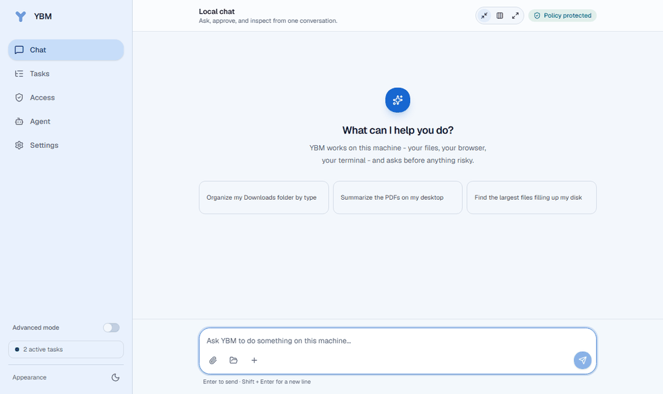

<div align="center">


# YBM

**A local AI agent you can reach from the web, Telegram, and WhatsApp.**

[](LICENSE)
[](backend/pyproject.toml)
[](docker-compose.yml)
[](#choose-a-model)



</div>

YBM runs on your machine and turns a message into either a direct reply or a traceable task. Tasks
can use the tools you enable, including files, terminal commands, Chrome, VS Code, desktop control,
scheduled work, MCP servers, and coding agents.

## The question YBM answers

Plenty of agents can write you a paragraph. The hard question is whether you can let one **touch your
actual computer**. Every task runs the same five stages, and you can stop it at any of them:

```text
Plan  ->  Approve  ->  Execute  ->  Verify  ->  Receipt
 |         |            |            |           |
 |         |            |            |           +-- every file it touched, every
 |         |            |            |               command it ran, what left the
 |         |            |            |               machine, and what it is unsure of
 |         |            |            +-- the answer is checked against the evidence,
 |         |            |                not just asserted
 |         |            +-- policy is enforced per tool call, not once at the start
 |         +-- anything consequential stops and asks, showing its blast radius first
 +-- related changes are grouped and shown as one list, before any of them run
```

High-impact capabilities are off until you turn them on, filesystem access is limited to roots you
choose, and approvals are short-lived rather than standing grants. It is built for three jobs in
particular:

1. **Safely organise and change files on your actual computer.**
2. **Do browser and desktop work for you, asking before anything consequential.**
3. **Run a long multi-step task and prove afterwards exactly what happened.**

> YBM is alpha software. Start with a test directory, review the access settings, and keep the admin
> console bound to localhost unless you understand the authentication and network implications.

## Install

Python, Git, and `uv` do not need to be preinstalled: the install bootstraps `uv`, uses it to provide
Python 3.12, creates the project environment, initializes local config and tokens, and starts YBM.
Node.js 22.22+ does need to be present for the admin console to be built - see below.

> **No release has been published yet.** YBM installs from source today. There is no installer to
> download, no `winget` package, and no release archive; the packaging for those exists in this
> repository but has never been run against a tag. Everything below is the source install, which is
> tested and works.

### Windows

**Either** run this in PowerShell:

```powershell
irm https://raw.githubusercontent.com/iodriller/YBM/main/scripts/install.ps1 | iex
```

Nothing is written to disk before it runs. Swap `iex` for `more` to read it first.

**Or** download the repository as a ZIP, extract the whole folder, and double-click
[`YBM.bat`](YBM.bat). It installs whatever is missing and writes nothing outside that folder. The
same file handles the first run and every run after it.

For visible output and a post-install check, from an extracted copy:

```powershell
powershell -NoProfile -ExecutionPolicy Bypass -File .\scripts\install.ps1 -Verify
```

**Node.js 22.22 or newer is required** for a source install to have a usable console. The console is
a React app that is built during setup; without Node.js the backend still runs, but `/admin` serves
build instructions instead of the console. The optional WhatsApp bridge needs Node.js as well. (The
unreleased packaging ships the console prebuilt, which is what will remove this requirement.)

### macOS and Linux

```bash
curl -fsSL https://raw.githubusercontent.com/iodriller/YBM/main/scripts/install.sh | bash
```

Needs Bash and `curl`. It uses Git when available and falls back to a source archive when it is not,
then hands off to `./ybm.sh`.

From a checkout you already have:

```bash
./ybm.sh                        # install anything missing, start, open the console
bash ./scripts/install.sh --verify   # same, plus a post-install check
```

`./ybm.sh` is the counterpart to `YBM.bat`: it installs `uv`, Python 3.12, and dependencies, then
starts YBM. Run it again any time; it does nothing when there is nothing to do. Pass `--no-desktop`
to skip the desktop-control extras on a headless box.

As on Windows, a source install needs **Node.js 22.22+** for the console to be built.

If the machine has no browser, configure the model and Telegram interactively with:

```bash
./backend/.venv/bin/ybm onboard
```

### Docker

Docker is the headless profile. It includes the admin console and WhatsApp runtime, but it cannot
control the host desktop, attach to the host VS Code session, or use display-dependent browser
automation.

```bash
cp .env.example .env
# Edit .env and set AGENT_ADMIN_TOKEN to a long random value.
docker compose up -d --build
# Open http://127.0.0.1:8765/admin and enter the token when prompted.
```

The compose file stores runtime state in the `ybm-state` volume, writes settings to
`config/config.yaml`, and exposes only `./workspace` to filesystem tools. Put durable cloud API keys
in the host `.env` file. To run an Ollama container too:

```bash
docker compose --profile ollama up -d --build
docker compose exec ollama ollama pull qwen3:8b
```

## First run

The browser wizard has two steps:

1. Choose a local model or configure a cloud provider. YBM verifies access, lists models when the
   provider supports it, and makes one small completion before saving the choice.
2. Use the built-in web chat immediately, or optionally connect Telegram. WhatsApp is configured
   later under Settings.

Both wizard steps can be skipped. A skipped model means chat and task classification will not work
until a model is configured under Settings. See [Local setup](docs/LOCAL_SETUP.md) for manual and
headless configuration.

## Choose a model

| Local, no API key | Cloud API key |
|---|---|
| Ollama, LM Studio, LocalDeploy | Anthropic, OpenAI, OpenRouter, Google Gemini, Groq, DeepSeek, Mistral, xAI, Together AI |

The provider picker also accepts a custom OpenAI-compatible endpoint. Anthropic uses its native
SDK; the remaining cloud providers and local runtimes use their OpenAI-compatible APIs.

Using a local model keeps model prompts and completions on the configured local endpoint. Other
enabled tools, such as web search or HTTP requests, can still contact external services.

## Channels

- **Web chat:** available in the admin console after a model is configured.
- **Telegram:** optional bot integration with user and chat allowlists. Text, commands, approvals,
  voice transcription, and artifact delivery are supported.
- **WhatsApp:** optional, text-only integration through the unofficial Baileys WhatsApp Web client.
  It requires Node.js, QR linking, and an explicit phone-number allowlist.

An empty Telegram or WhatsApp allowlist denies every incoming message.

## What it can do

- Search, read, and organize files inside configured roots.
- Run bounded terminal commands, Python code, and supported coding agents.
- Use Chrome, screenshots, and Windows desktop control when enabled.
- Schedule recurring work and continue long-running tasks.
- Connect to MCP servers and expose its own MCP entry point.
- Work with VS Code through the optional bridge extension.
- Store attributed memory and search an indexed local knowledge base.
- Produce task traces with tool results, approvals, LLM receipts, timing, and cost data.

Capabilities and adapters are separate controls. Enabling an adapter does not bypass its capability
policy. See [Capabilities](docs/CAPABILITIES.md) for the implemented tool catalog.

## Safety model

High-impact capabilities start disabled. Filesystem access is restricted to configured roots.
Terminal, browser, desktop control, dependency installation, and Git pushes are separately gated.
Risky operations require short-lived approvals enforced by the runtime. Secrets are redacted from
logs and task output, and each task retains an audit trail.

Read the [Threat model](docs/THREAT_MODEL.md) before granting access to important files or accounts.
See [SECURITY.md](SECURITY.md) for vulnerability reporting.

## How it works

```text
Telegram  \
WhatsApp  +--> Concierge --> Operator <--> Policy <--> Tools
Web chat  /         |            |
                    +--> reply    +--> Auditor --> result and trace
```

The FastAPI backend owns orchestration, policy, persistence, and adapters. The React console talks
to it through `/admin/api/*`. Telegram and WhatsApp are channel adapters over the same task pipeline,
and the VS Code extension is an editor bridge rather than a second agent runtime. See
[Architecture](docs/ARCHITECTURE.md) and [Roles](docs/ROLES.md) for details.

## Everyday commands

On Windows, use the repository lifecycle wrapper:

```powershell
.\scripts\ybm.ps1 doctor
.\scripts\ybm.ps1 start -Open
.\scripts\ybm.ps1 status
.\scripts\ybm.ps1 logs worker -Follow
.\scripts\ybm.ps1 stop
```

On macOS and Linux, use the installed console script:

```bash
./backend/.venv/bin/ybm doctor
./backend/.venv/bin/ybm start --open
./backend/.venv/bin/ybm status
./backend/.venv/bin/ybm logs worker --follow
./backend/.venv/bin/ybm stop
```

Run `.\scripts\ybm.ps1 help` or `./backend/.venv/bin/ybm --help` for the command available on that
interface. Windows-only conveniences include the tray app, login autostart, test runner, scenario
tools, and extension packaging.

## Development

```powershell
.\scripts\ybm.ps1 setup
.\scripts\ybm.ps1 doctor
.\scripts\ybm.ps1 test
```

See [CONTRIBUTING.md](CONTRIBUTING.md) for focused verification commands. Deterministic backend tests
do not need a network connection, GPU, Telegram account, or paid model call. Live E2E and scenario
recording have separate prerequisites and can make external calls.

## Documentation

| Guide | Contents |
|---|---|
| [Local setup](docs/LOCAL_SETUP.md) | Installers, manual setup, runtime commands, and local data |
| [Architecture](docs/ARCHITECTURE.md) | Current components and message flow |
| [Roles](docs/ROLES.md) | Concierge, Operator, and Auditor responsibilities |
| [Capabilities](docs/CAPABILITIES.md) | Implemented tools and their policy gates |
| [Threat model](docs/THREAT_MODEL.md) | Trust boundaries, protections, and residual risk |
| [Database inspection](docs/DATABASE_INSPECTION.md) | Inspect, prune, reset, and trace local state |
| [Known gaps](docs/GAPS.md) | Current limitations and unimplemented behavior |
| [History](docs/HISTORY.md) | Design rationale and completed phases |

## Current limitations

- The project is alpha and is tested most heavily on Windows.
- Desktop observation and control are Windows-only.
- WhatsApp is text-only and uses an unofficial client, which carries account risk.
- Voice transcription is disabled by default and needs the `voice` dependency extra.
- Docker cannot access host desktop or editor sessions, and only mounted paths are visible.

MIT licensed.
