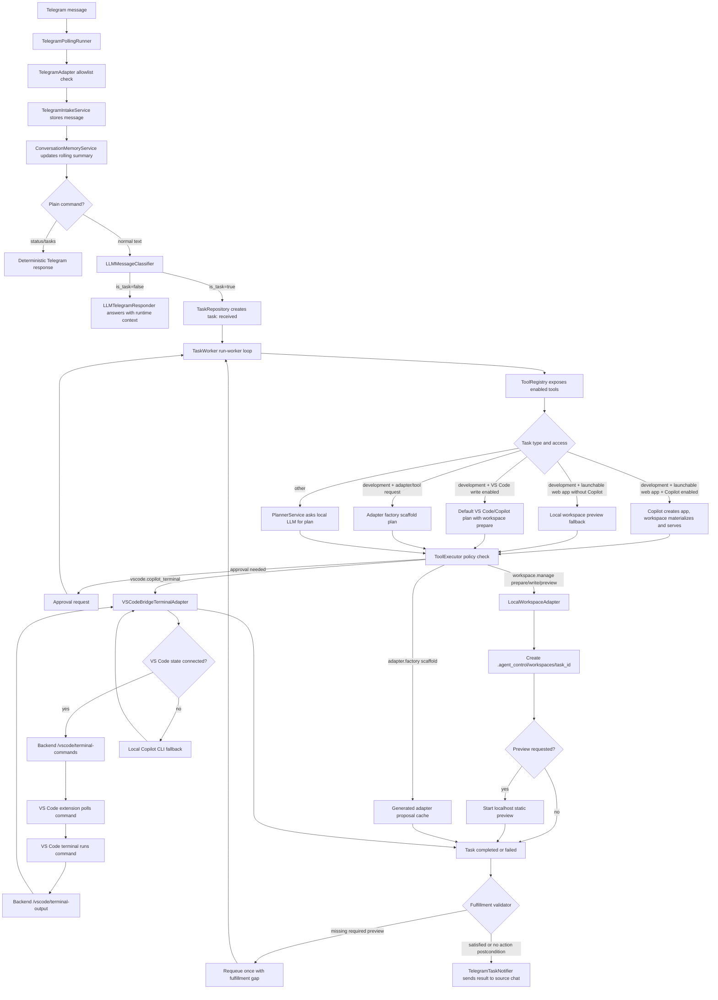

# YBM Architecture — Message to Answer

Replaces `FLOW.md`, `FLOW_DIAGRAMS.md`, and `TASK_FLOW.md` (merged 2026-07-27; those three
had overlapping, partially stale content — see [ROADMAP.md](ROADMAP.md) §6). Describes the
current (pre-P3) pipeline. **P3 of the roadmap collapses the ten LLM roles below into three
agents (Concierge / Operator / Auditor) and replaces plan-once-then-replan with an agent
loop — this document gets rewritten as part of that work, not just patched.**

---

## High-Level Flow

```
Telegram Message
    │
    ▼
[1. Intake & Classification]
    │   ├─ Deterministic browser guard (regex: domain/URL detected → force task)
    │   └─ LLM Classifier → is_task? + intent route
    │
    ├─ is_task=false → LLM Responder → direct Telegram reply
    │
    └─ is_task=true → TaskRecord(RECEIVED) created in DB
                            │
                            ▼
[2. Planning (TaskWorker, RECEIVED → PLANNED)]
    │   └─ LLM Planner → PlanModel (ordered steps with tool_name + input)
    │       • Input: objective + full tool registry context + memory context
    │       • Validates plan against registered tools
    │       • Fallback to hardcoded factory for status/system commands
    │
    ▼
[3. Execution (PLANNED → RUNNING, step by step)]
    │   For each PlanStep:
    │   ├─ Resolve {{placeholders}} (workspace_dir, last_entry_path, etc.)
    │   ├─ PolicyEngine checks capability enabled + risk level
    │   ├─ ToolExecutor.execute() → adapter (browser, filesystem, code, etc.)
    │   └─ Result recorded in task metadata
    │
    ├─ Step failed → RetryPolicy → RecoveryPlanFactory → LLM replan (up to 2x)
    │
    └─ All steps done → Synthesize & Validate
                            │
                            ▼
[4. Synthesis & Validation (after last content-tool step)]
    │   ├─ ResponseSynthesizer: raw tool output → focused answer (LLM call)
    │   ├─ AnswerValidator: focused answer + objective → valid? (LLM call)
    │   ├─ If answer valid → store metadata.synthesized_answer
    │   └─ If insufficient or invalid → LLM replan (up to 2x)
    │
    ▼
[5. Fulfillment Check (→ COMPLETED)]
    │   └─ validate_fulfillment: structural postconditions
    │       (browser state present? workspace created? etc.)
    │       If gap detected → recovery plan or retry (up to 2x)
    │
    ▼
[6. Notification (COMPLETED → Telegram)]
    │   Priority order for reply text:
    │   1. metadata.synthesized_answer  ← synthesizer output (best)
    │   2. _completed_answer()           ← formatted raw tool output
    │   3. "Done."                       ← last resort
    │
    └─ Screenshot (if available) sent as separate photo
```

## Diagram



## Key Components

| Component | File | Role |
|-----------|------|------|
| Deterministic guard | `channels/telegram.py:_is_forced_browser_task` | Regex check — forces `is_task=True` for any message with a domain/URL, bypasses LLM classifier |
| LLM Classifier | `llm/classifier.py` | Routes messages to task or conversation; uses `base/classifier_system.md` |
| LLM Responder | `channels/responder.py` | Answers non-task conversational messages; uses `base/telegram_gateway_system.md` |
| LLM Planner | `llm/planner.py` | Generates ordered PlanModel from objective + tool registry; uses `base/planner_system.md` |
| Tool Registry | `tools/registry.py` | Registers enabled tools; provides `context()` string injected into planner prompt |
| Task Worker | `orchestration/worker.py` | Run-forever loop; orchestrates RECEIVED→PLANNED→RUNNING→COMPLETED transitions |
| Tool Executor | `orchestration/executor.py` | Dispatches ToolCallRequest to the correct adapter; enforces policy |
| Retry/Recovery | `orchestration/worker.py` + `recovery.py` | Step failure → retry → recovery plan → LLM replan (up to 2 replans) |
| Fulfillment Validator | `orchestration/fulfillment.py` | Structural check — did required outputs (browser_state, workspace_dir, etc.) appear? |
| Response Synthesizer | `llm/synthesizer.py` | Converts raw tool output → focused natural-language answer; uses `base/synthesizer_system.md` |
| Answer Validator | `llm/validator.py` | Checks if synthesized answer addresses the objective; uses `base/validator_system.md` |
| Notifications | `channels/telegram_notifications.py` | Formats and sends final Telegram reply |
| Conversation Memory | `channels/memory.py` | Rolling summary of prior turns; injected into classifier + planner context |

## Prompt Files

All system prompts live in `backend/src/agent_control/prompts/`.

```
prompts/
├── base/                          ← system prompts (role definitions)
│   ├── classifier_system.md       ← LLM Classifier role
│   ├── planner_system.md          ← LLM Planner role + rules + examples
│   ├── synthesizer_system.md      ← Response Synthesizer role
│   ├── validator_system.md        ← Answer Validator role
│   ├── telegram_gateway_system.md ← LLM Responder (non-task chat)
│   ├── conversation_memory_system.md
│   ├── computer_use_system.md
│   ├── code_interpreter_system.md
│   ├── folder_image_ocr_system.md
│   └── llm_health_check_system.md
│
├── tasks/                         ← user prompt templates (${variable} substitution)
│   ├── classifier_user.md
│   ├── planner_user.md
│   ├── validator_user.md
│   ├── telegram_gateway_user.md
│   ├── conversation_memory_user.md
│   ├── structured_retry.md        ← retry template for JSON parse failures
│   └── ...
│
└── tools/                         ← tool-specific prompts (Copilot, adapter factory)
    ├── copilot_development.md
    ├── copilot_web_app.md
    └── ...
```

## Replan/Recovery Budgets

Each task carries these counters in `metadata`; when all are exhausted the task transitions
to `FAILED` or `BLOCKED`:

| Counter | Max | Triggered by |
|---------|-----|---------------|
| `replan_count` | 2 | Synthesizer returns `INSUFFICIENT` (content empty/unrelated); validator rejects the answer |
| `evaluator_repair_count` | 2 | Recovery plan factory (step-level error recovery, e.g. `ADAPTER_FAILED`) |
| `fulfillment_retry_count` | 2 | Structural postcondition gap at the COMPLETED transition |
| `retry_count` | Configurable | Transient step failure (network timeout, temp error) |

On replan, the worker enriches the objective with error context (e.g. "Previous attempt
failed: content did not contain answer. Try a different approach or tool") and calls the
planner again — this is how a `browser.control extract_page_state` failure becomes a
`browser.open summarize_page` retry without a human in the loop.

## Content Tools (Synthesizer + Validator Apply)

Synthesis and validation only run for tools that return human-readable content:
`browser.open`, `browser.control`, `code.interpreter`, `filesystem.manage`,
`document.manage`, `computer.use`. Tools that return structured state (schedule IDs,
workspace paths, PR URLs) skip synthesis — their outputs go directly through
`_completed_answer()` formatting.

## Tool Registry

Tools are registered through `backend/src/agent_control/tools/registry.py` — that is the
single source of truth for what's enabled and what operations each tool supports; treat any
tool count or list here as illustrative, not authoritative, since it drifts as tools are
added. As of this writing: `workspace.manage`, `filesystem.manage`, `adapter.factory`,
`code.interpreter`, `http.request`, `mcp.client`, `vscode.copilot_terminal`,
`vscode.terminal_command`, `tts.synthesize`, `coding.agent`, `schedule.manage`,
`task.status`, `artifact.deliver`, `document.manage`, `computer.use`, `browser.open`,
`browser.control`.

Registered tools carry typed input/output contracts. The executor validates input before
policy and adapter execution, and validates successful outputs before recording a result as
succeeded — malformed input or incomplete adapter output surfaces as `validation_failed`
instead of silently no-op'ing or misinterpreting a bad payload.

Missing tools route to `adapter.factory` for a scaffolded, reviewable proposal rather than
letting the planner invent an unregistered tool name. Generated adapters are cache artifacts
under `.agent_control/adapters` only — never imported or executed until reviewed, tested,
and registered. Promotion is a manual step: review the proposal, add tests, move it into
`backend/src/agent_control/tools/`, and register it in `tools/registry.py`. If VS Code/Copilot
is enabled, the default adapter plan can ask Copilot to refine the proposal in place first.

## Telegram Gateway Behavior

- Plain `status` and `/status` return deterministic task status without an LLM call.
  `/tasks`, `/task <id>`, `/logs <id>`, `/pause <id>`, `/resume <id>`, `/cancel <id>` are
  command routes, also deterministic.
- Non-task messages (`what can you do?`) get a direct local LLM answer with a short
  capability/task context — not the whole conversation, see Conversation Memory below.
- Messages classified as executable tasks are persisted and picked up by the worker.
- Worker completion, failure, blocked, cancelled, and approval-needed states are all sent
  back to the source Telegram chat.

## Task Types And Pickup Rules

The classifier writes one of these `TaskType` values: `development`, `configuration`,
`admin_control`, `desktop_observation`, `question`, `status_request`, `other`. Only messages
classified `is_task=true` become persisted tasks.

Tasks are created with status `received`. `.\scripts\ybm.ps1 start` starts the worker (or
run `scripts\services\run_worker.ps1` directly to debug just the worker). The worker
processes `received`, `interpreting`, `planned`, `awaiting_approval`, `running`, and
`retrying` tasks; it skips `paused`, `cancelled`, `completed`, `failed`, and `blocked`
unless a control action changes their status.

## VS Code And Copilot

The bridge queues a command into the VS Code integrated terminal and waits for a matching
terminal-output record. If no VS Code state is connected, the adapter falls back to running
the local Copilot CLI directly (`gh copilot -p '<task prompt>'`, requires GitHub CLI Copilot
installed and authenticated) and still reports the captured output. VS Code terminal stdout
capture depends on VS Code shell integration; without it, the extension records dispatch
completion only. Direct GitHub Copilot Chat panel response capture is not implemented —
there is no stable public API for reading Copilot Chat answers from the chat panel. When
the WinGet Copilot CLI path is available, the backend uses the full `copilot.exe` path
instead of relying on a freshly restarted shell's `PATH`. If the CLI fails, the fallback
retries once with a plain-text-only prompt before surfacing the error. Copilot CLI usage
lines (request/token counts) are parsed from stdout when the CLI prints them and included
in the stored tool result and Telegram completion message.

For general development tasks, the deterministic plan prepares a task workspace first (when
`filesystem.write` is enabled), then passes it as `cwd` to the VS Code/Copilot step.

## Conversation Memory

Stored in the `conversation_memory` table as a compact LLM-updated summary plus a bounded
recent-turn list. The summarizer receives only the previous memory plus the recent-turn
window (not the full conversation) and falls back to a deterministic rolling summary if the
LLM call fails or times out.

## Local Workspace

Every development task can get a dedicated workspace when `filesystem.write` is enabled,
rooted at `.agent_control/workspaces/task_<id>`. `workspace.manage` operations: `prepare`
(create workspace + `TASK.md`), `write_files` (write validated relative paths inside it),
`materialize_static_app` (use Copilot code-block output or existing files), `launch_static`
(serve over localhost), `web_app_preview` (write a minimal app and serve it). Launchable
web-app requests use Copilot as the primary creator when `vscode.write_files` is enabled; if
Copilot is disabled, the workspace preview fallback still produces a visible app. Requires
`filesystem.write` access (set **File system** to **Full write** for approval-free workspace
actions, or **Write with approval** to pause for approval). Root, host, starting port, and
browser-open behavior are configurable under **Local Workspace** in the admin UI or directly:

```yaml
adapters:
  workspace:
    enabled: true
    root_dir: .agent_control/workspaces
    web_host: 127.0.0.1
    web_port_start: 8890
    open_browser: true
```

## Browser And Computer-Use Notes

`browser.open`/`browser.control` operate only on Chrome tabs exposed through the configured
DevTools remote debugging port (`adapters.browser.remote_debugging_port`, default `9222`).
If Chrome isn't there and `launch_if_missing` is true, the adapter starts a separate Chrome
profile under `.agent_control/browser/chrome-profile` — arbitrary already-open Chrome
windows without remote debugging are not visible to this adapter.

`computer.use observe` returns a screenshot and UI metadata without taking control actions.
`computer.use run_goal` is for bounded desktop-control sessions and should stay
session-approved unless desktop control is set to full access; it uses the active local
multimodal provider for observe-act decisions and fails clearly (not silently) if that
provider can't accept image payloads. The worker checks task cancellation before each
action, so pause/cancel from the UI stops the loop before the next mouse/keyboard action.
Prefer `filesystem.manage` over desktop automation for folder tasks — it's safer and more
auditable (returns a manifest and changed paths); allowed roots live in
`adapters.computer_use.allowed_roots`.

## Config And Env

`config/config.yaml` is the source of truth for non-secret runtime configuration: profiles,
enabled adapters, access modes, allowlists, workspace paths, ports, model selection. `.env`
is reserved for secrets: `TELEGRAM_BOT_TOKEN`, `OPENAI_API_KEY`, `VSCODE_BRIDGE_TOKEN`,
`AGENT_ADMIN_TOKEN`, `AGENT_SECRET_VAULT_KEY`, `YBM_LOCALDEPLOY_ROOT`.

## Worked Example: A Real Audit Trace

Objective: `Create me a app for hamsters and launch it` (task `task_bd26e132de50433aadaf2678ea4db2f4`).

- `message_received`: Telegram stored the raw message.
- `message_classified`: classified `development`. The local LLM returned an invalid
  response, so the classifier fell back to its actionable-task heuristic.
- `task_created`: persisted with source Telegram metadata.
- `plan_created`: `default_vscode_development_plan` — steps were prepare workspace, ask
  Copilot, materialize Copilot app files, launch static preview.
- Copilot couldn't write files directly (permission denied in that path) but returned
  fenced file code blocks; `workspace.manage` materialized those into the task workspace.
- `launch_static` started a local preview at `http://127.0.0.1:8890/`.
- Task moved `running` → `completed`; metadata recorded `workspace_dir`, `preview_url`,
  Copilot usage lines, `notified_statuses`.

## Known Gaps

- GitHub PR creation/review has postcondition support but no registered GitHub adapter.
- Desktop automation depends on local Windows libraries (`mss`, `pyautogui`, `pywinauto` —
  the `[desktop]` extra) and a vision-capable local model profile.
- Closure validation is still mostly key-based; richer typed artifacts (browser DOM state,
  screenshot metadata, file-move manifests, PR state) would let validators prove outcomes
  more precisely instead of inferring them.
