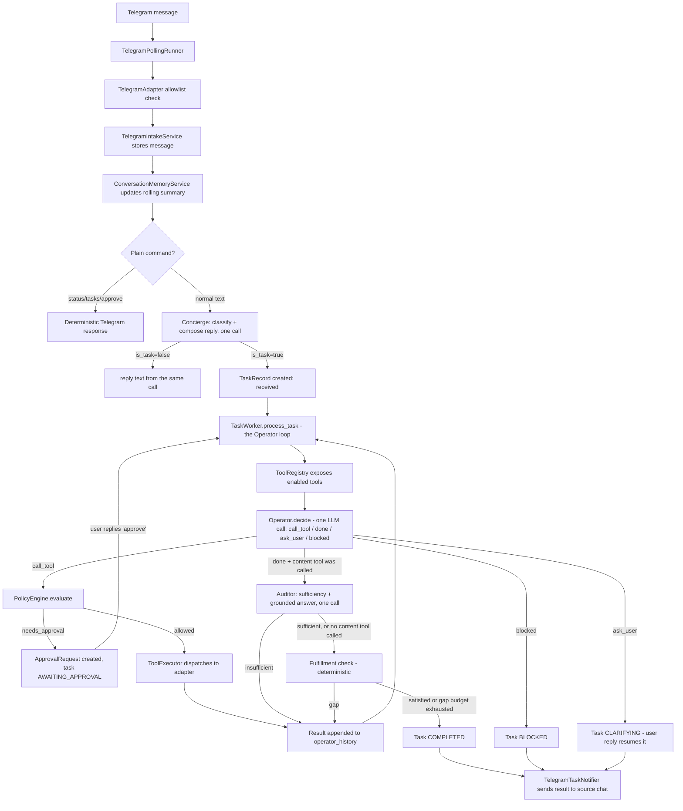

# YBM Architecture — Message to Answer

Rewritten 2026-07-28 for the post-P3 architecture (see [HISTORY.md](HISTORY.md) Part 1 P3 and
Part 2). The system now runs on **three agents, many tools** (§2.1 of Part 1):
**Concierge** (chat-vs-task front door), **Operator** (the execution loop), and
**Auditor** (grounds the final answer). The old plan-once-then-replan pipeline —
`llm/planner.py`, `llm/synthesizer.py`, `llm/validator.py`, `orchestration/default_plans.py`,
`orchestration/recovery_policy.py` — is deleted, not deprecated. If you find a doc, comment,
or test referencing those, it's stale; file it as a bug.

---

## High-Level Flow

```
Telegram Message
    │
    ▼
[1. Concierge (channels/telegram.py + llm/classifier.py)]
    │   ├─ Conversation memory updated first (this turn's text folded in
    │   │  before classification reads it)
    │   ├─ Plain-text commands (/status, /pause, "approve", ...) short-circuit,
    │   │  no LLM call
    │   └─ One structured-output LLM call: classify AND (if chat) compose the
    │       reply, together (prompts/base/concierge_system.md)
    │
    ├─ is_task=false → reply text is in the SAME response (no second LLM call);
    │                   status_request bypasses the LLM entirely
    │
    └─ is_task=true → TaskRecord(RECEIVED) created, objective = normalized_objective
                            │
                            ▼
[2. Operator loop (orchestration/worker.py, RECEIVED → RUNNING, repeats)]
    │   One observe → decide → act tick per poll, until done/blocked/budget:
    │   ├─ decide(): ONE structured-output LLM call (prompts/base/operator_system.md)
    │   │   given the objective + tool catalogue + history so far, returns
    │   │   call_tool | done | ask_user | blocked (each call declares its own
    │   │   risk_level - ToolDefinition carries none statically)
    │   ├─ gate: PolicyEngine.evaluate() - capability enabled? risk within
    │   │   policy? approval required?
    │   ├─ act: ToolExecutor dispatches to the adapter; NEEDS_APPROVAL creates
    │   │   a real ApprovalRequest and pauses (AWAITING_APPROVAL) instead of
    │   │   failing the task
    │   └─ record: result appended to metadata.operator_history; on RATE_LIMITED
    │       the loop backs off (RETRYING + next_retry_at) instead of hot-looping
    │       the next poll tick
    │
    └─ decide() returns `done` →
                            ▼
[3. Auditor (orchestration/auditor.py, gates the `done` decision)]
    │   Only runs if a "content tool" was called (browser/filesystem/document/
    │   code-interpreter/computer-use/http/mcp - AuditorService.CONTENT_TOOLS).
    │   One LLM call, merging what used to be two:
    │   ├─ sufficiency check: does the raw tool output actually contain what
    │   │   was asked (count/topic/section), or is more work needed?
    │   ├─ insufficient → appended to operator_history as an observation, loop
    │   │   continues (capped at 2 cycles) - NOT a separate recovery plan
    │   └─ sufficient → extracts the grounded, focused answer, which REPLACES
    │       the operator's own final_answer
    │
    ▼
[4. Fulfillment check (orchestration/fulfillment.py, always runs on `done`)]
    │   Objective-text-inferred postconditions (workspace created? browser state
    │   present? artifact delivered? ...) - deterministic, no LLM call. Gap →
    │   same "append to history, keep looping" pattern as the Auditor, capped
    │   at 2 cycles, then completes anyway with the gap flagged in metadata.
    │
    ▼
[5. Notification (COMPLETED/FAILED/BLOCKED/CLARIFYING/... → Telegram)]
    │   Priority order for reply text:
    │   1. metadata.synthesized_answer  ← Auditor's grounded answer, or the
    │      operator's own final_answer if the Auditor never ran
    │   2. formatted raw tool output / status-specific message
    │   3. "Done."                       ← last resort
    │   RUNNING/RETRYING progress messages are deduped per operator step
    │   (not per status), so a multi-step task sends one update per tool call,
    │   not one "working on it" and then silence.
```

## Diagram



## Key Components

| Component | File | Role |
|-----------|------|------|
| Concierge classifier+responder | `llm/classifier.py` | Classify chat-vs-task AND compose the chat reply, one call; uses `base/concierge_system.md`. Falls back to the separate `channels/responder.py` (`base/telegram_gateway_system.md`) for a classifier that doesn't populate `.reply` |
| Telegram intake | `channels/telegram.py` | Plain-command routing, conversation-memory update ordering, chat-vs-task gate, task creation |
| Conversation Memory | `channels/memory.py` | Rolling summary of prior turns; own LLM call with a heuristic fallback, deliberately not merged into the Concierge call (ordering + failure-isolation, see HISTORY.md Part 1 P3 item 4) |
| Operator loop | `orchestration/operator.py` + `orchestration/worker.py` | `OperatorLoopService.decide()` (one structured-output call) + `TaskWorker._process_operator_loop()` (the observe/gate/act/record tick, approval flow, rate-limit backoff, background-session resume) - the sole execution path |
| Tool Registry | `tools/registry.py` (thin) + `tools/spec.py` | Each tool module registers itself via `register(deps, definitions, adapters)`; `build_tool_registry()` just collects them and provides `context()` injected into the Operator's prompt |
| Tool Executor | `orchestration/executor.py` | Dispatches `ToolCallRequest` to the adapter; enforces policy; validates input/output contracts |
| Auditor | `orchestration/auditor.py` | Grounds a `done` decision against raw tool output, one call merging the old validator+synthesizer; uses `base/auditor_system.md` |
| Fulfillment check | `orchestration/fulfillment.py` | Deterministic, objective-text-inferred postconditions (no LLM, no PlanModel - that path was deleted, see HISTORY.md §1.1) |
| Notifications | `channels/telegram_notifications.py` | Formats and sends the Telegram reply; per-step progress dedup keys off `operator_history` length |
| Structured logging | `logging_setup.py` | structlog → JSON file + console per service, `task_id` bound as a contextvar for the duration of each `process_task()` call (HISTORY.md §2.1) |

## Prompt Files

All system prompts live in `backend/src/agent_control/prompts/`. Three top-level agent
prompts; everything else is a tool's own internal prompt, not a fourth agent (§2.1: "Stop
giving them top-level prompt files").

```
prompts/
├── base/                          ← system prompts (role definitions)
│   ├── concierge_system.md        ← Concierge: classify + chat reply, one call
│   ├── operator_system.md         ← Operator: observe/decide/act, one call per step
│   ├── auditor_system.md          ← Auditor: sufficiency + grounded answer, one call
│   ├── telegram_gateway_system.md ← fallback chat responder (kept, not primary - see Key Components)
│   ├── conversation_memory_system.md
│   ├── computer_use_system.md     ← tool-internal, not an agent
│   ├── code_interpreter_system.md ← tool-internal
│   ├── folder_image_ocr_system.md ← tool-internal
│   └── llm_health_check_system.md
│
├── tasks/                         ← user prompt templates (${variable} substitution)
│   ├── concierge_user.md
│   ├── operator_user.md
│   ├── auditor_user.md
│   ├── telegram_gateway_user.md
│   ├── conversation_memory_user.md
│   ├── structured_retry.md        ← retry template for JSON parse failures
│   └── ...
│
└── tools/                         ← tool-specific prompts (Copilot, adapter factory)
    ├── copilot_development.md
    ├── copilot_web_app.md
    └── ...
```

## Gap-Handling Budgets

Each task carries these counters in `metadata`; when a budget is exhausted the loop either
completes anyway (flagging the gap) or fails outright:

| Counter | Max | Triggered by | On exhaustion |
|---------|-----|---------------|----------------|
| `operator_max_steps` (config, default 8) | 8 real tool calls | Every `call_tool` decision. Fulfillment/audit gap check entries do NOT count against this (HISTORY.md §3.1 - they used to, which could exhaust the whole budget on bookkeeping alone) | Task FAILED |
| `operator_audit_gap_count` | 2 | Auditor judges the raw output insufficient after a `done` decision | Completes anyway with the operator's own `final_answer` |
| `operator_fulfillment_gap_count` | 2 | Deterministic postcondition check fails after a `done` decision | Completes anyway with `metadata.fulfillment_gap` set |
| `clarify_count` | 2 | `ask_user` decision, or usage-limit backoff | Task FAILED |

On a gap, the loop does **not** build a new plan or replan from scratch - the gap is appended
to `operator_history` as an observation, and the *next* `decide()` call sees it in context and
chooses what to do about it. This is the whole point of §2.2: "recovery becomes 'the next
decide() call sees the error in context.'"

## Content Tools (Auditor Applies)

The Auditor only runs when the loop called a tool that returns human-readable content:
`browser.open`, `browser.control`, `code.interpreter`, `filesystem.manage`,
`document.manage`, `computer.use`, `http.request`, `mcp.client`
(`AuditorService.CONTENT_TOOLS`). A task that never touches one of these (status checks,
schedule management, a delivery-only step) skips the Auditor entirely and completes on the
operator's own `final_answer` plus the fulfillment check. Note `artifact.deliver` is
deliberately **not** in this list yet - a task whose last real step is "send the file" isn't
audited (HISTORY.md §4 item 6, an open gap).

## Tool Registry

Tools are registered through `backend/src/agent_control/tools/registry.py` — that is the
single source of truth for what's enabled and what operations each tool supports; treat any
tool count or list here as illustrative, not authoritative, since it drifts as tools are
added. As of this writing: `workspace.manage`, `filesystem.manage`, `adapter.factory`,
`code.interpreter`, `http.request`, `mcp.client`, `vscode.copilot_terminal`,
`vscode.terminal_command`, `tts.synthesize`, `coding.agent`, `schedule.manage`,
`task.status`, `artifact.deliver`, `document.manage`, `computer.use`, `browser.open`,
`browser.control`.

Registered tools carry typed input/output contracts. The executor validates input before
policy and adapter execution, and validates successful outputs before recording a result as
succeeded — malformed input or incomplete adapter output surfaces as `validation_failed`
instead of silently no-op'ing or misinterpreting a bad payload.

Missing tools route to `adapter.factory` for a scaffolded, reviewable proposal rather than
the Operator inventing an unregistered tool name. Generated adapters are cache artifacts
under `.agent_control/adapters` only — never imported or executed until reviewed, tested,
and registered. Promotion is a manual step: review the proposal, add tests, move it into
`backend/src/agent_control/tools/`, and register it via that module's own `register()`
function (see `tools/spec.py`). If VS Code/Copilot is enabled, the default adapter plan can
ask Copilot to refine the proposal in place first.

## Telegram Gateway Behavior

- Plain `status` and `/status` return deterministic task status without an LLM call.
  `/tasks`, `/task <id>`, `/logs <id>`, `/pause <id>`, `/resume <id>`, `/cancel <id>`,
  plain-text `approve` are command routes, also deterministic.
- Non-task messages (`what can you do?`) get their reply from the SAME Concierge call that
  classified them - not a second LLM round trip. Falls back to `channels/responder.py`'s
  separate call only if the classifier in use doesn't populate `.reply`.
- Messages classified as executable tasks are persisted and picked up by the worker.
- Worker completion, failure, blocked, cancelled, clarifying, and approval-needed states are
  all sent back to the source Telegram chat, with a per-step-deduped progress message while
  running (see Gap-Handling Budgets above / HISTORY.md §3.3).

## Task Statuses And Pickup Rules

The Concierge writes one of these `TaskType` values: `development`, `configuration`,
`admin_control`, `desktop_observation`, `question`, `status_request`, `other`. Only messages
classified `is_task=true` become persisted tasks.

Tasks are created with status `received`. `.\scripts\ybm.ps1 start` starts the worker (or
run `scripts\services\run_worker.ps1` directly to debug just the worker). The worker claims
`received`, `interpreting`, `planned`, `awaiting_approval`, `running`, and `retrying` tasks
(`WORKABLE_STATUSES`) and always routes them through the Operator loop regardless of status -
`interpreting`/`planned` are pre-P3 statuses nothing transitions *into* anymore, kept in the
claimable set only so a task stuck in one from before the P3 migration isn't stranded forever.
The worker skips `paused`, `cancelled`, `completed`, `failed`, and `blocked` unless a control
action changes their status.

## VS Code And Copilot

The bridge queues a command into the VS Code integrated terminal and waits for a matching
terminal-output record. If no VS Code state is connected, the adapter falls back to running
the local Copilot CLI directly (`gh copilot -p '<task prompt>'`, requires GitHub CLI Copilot
installed and authenticated) and still reports the captured output. VS Code terminal stdout
capture depends on VS Code shell integration; without it, the extension records dispatch
completion only. Direct GitHub Copilot Chat panel response capture is not implemented —
there is no stable public API for reading Copilot Chat answers from the chat panel. When
the WinGet Copilot CLI path is available, the backend uses the full `copilot.exe` path
instead of relying on a freshly restarted shell's `PATH`. If the CLI fails, the fallback
retries once with a plain-text-only prompt before surfacing the error. Copilot CLI usage
lines (request/token counts) are parsed from stdout when the CLI prints them and included
in the stored tool result and Telegram completion message.

For general development tasks, the Operator typically prepares a task workspace first (when
`filesystem.write` is enabled) before calling the VS Code/Copilot step with it as `cwd` -
this is now the Operator's own tool-sequencing decision each run, not a hardcoded plan
template.

## Local Workspace

Every development task can get a dedicated workspace when `filesystem.write` is enabled,
rooted at `.agent_control/workspaces/task_<id>`. `workspace.manage` operations: `prepare`
(create workspace + `TASK.md`), `write_files` (write validated relative paths inside it),
`materialize_static_app` (use Copilot code-block output or existing files), `launch_static`
(serve over localhost), `web_app_preview` (write a minimal app and serve it). Requires
`filesystem.write` access (set **File system** to **Full write** for approval-free workspace
actions, or **Write with approval** to pause for approval). Root, host, starting port, and
browser-open behavior are configurable under **Local Workspace** in the admin UI or directly:

```yaml
adapters:
  workspace:
    enabled: true
    root_dir: .agent_control/workspaces
    web_host: 127.0.0.1
    web_port_start: 8890
    open_browser: true
```

## Browser And Computer-Use Notes

`browser.open`/`browser.control` operate only on Chrome tabs exposed through the configured
DevTools remote debugging port (`adapters.browser.remote_debugging_port`, default `9222`).
If Chrome isn't there and `launch_if_missing` is true, the adapter starts a separate Chrome
profile under `.agent_control/browser/chrome-profile` — arbitrary already-open Chrome
windows without remote debugging are not visible to this adapter.

`computer.use observe` returns a screenshot and UI metadata without taking control actions.
`computer.use run_goal` is for bounded desktop-control sessions and should stay
session-approved unless desktop control is set to full access; it uses the active local
multimodal provider for observe-act decisions and fails clearly (not silently) if that
provider can't accept image payloads. The worker checks task cancellation before each
action, so pause/cancel from the UI stops the loop before the next mouse/keyboard action.
Prefer `filesystem.manage` over desktop automation for folder tasks — it's safer and more
auditable (returns a manifest and changed paths); allowed roots live in
`adapters.computer_use.allowed_roots`.

## Config And Env

`config/config.yaml` is the source of truth for non-secret runtime configuration: profiles,
enabled adapters, access modes, allowlists, workspace paths, ports, model selection,
`operator.max_steps`. `.env` is reserved for secrets: `TELEGRAM_BOT_TOKEN`, `OPENAI_API_KEY`,
`VSCODE_BRIDGE_TOKEN`, `AGENT_ADMIN_TOKEN`, `AGENT_SECRET_VAULT_KEY`, `YBM_LOCALDEPLOY_ROOT`.

`config/config.example.yaml` is the template `ybm setup` bootstraps a fresh `config.yaml`
from — keep it in sync with any new field that has a non-obvious default (HISTORY.md found and
fixed one real drift: this machine's `config.yaml` pinned an explicit `blocked_imports` list
that predated a security fix to the code default and silently didn't inherit it, since a
YAML-set list replaces the default rather than merging with it).

## Debugging A Task

`ybm trace <task_id>` prints a full post-mortem — operator steps (tool, input, output,
error), tool invocation count, audit event count — reading the DB directly, no running
backend required (HISTORY.md §2.4). Add `--json` for the raw payload. The same data renders in
the Streamlit admin UI's "Operator Steps" expander on each task card.

Structured logs live under `.agent_control/logs/<service>.jsonl`, one JSON object per line,
secrets redacted, `task_id` present on every line written while the Operator loop is
processing that task.

## Worked Example: A Real Scenario-Test Trace

Objective: `look in the folder <path> and find which file mentions a resume`
(`backend/tests/scenario/test_operator_loop.py`, fixture recorded against a live LLM - the
only scenario-tier coverage of the Operator loop verified end to end as of this writing, see
HISTORY.md §6 and HISTORY.md P3 item 1's disclosed regression on the other 16 cases).

- `decide()` #1 → `call_tool filesystem.manage {operation: search, query: resume}` →
  succeeded, found `resume.txt`.
- `decide()` #2 → `call_tool filesystem.manage {operation: read_file, path: resume.txt}` →
  succeeded, content read.
- `decide()` #3 → `done`, `final_answer` names the file and quotes its content.
- No content-tool audit gap, no fulfillment gap (this objective infers no postcondition from
  its text). Task COMPLETED; `metadata.synthesized_answer` is the operator's own answer, and
  `metadata.operator_history` has exactly these two tool-call entries.

## Known Gaps

What's actually still open, as of 2026-07-28 (everything else this document could plausibly
be missing has already been closed — see [HISTORY.md](HISTORY.md) for the full evidence
trail and how each item was fixed):

- **Secret vault has no UI.** `storage/secrets.py` (Fernet) exists; nothing in Streamlit or
  the admin API exposes it. `AGENT_SECRET_VAULT_KEY` is unset by default (`ybm doctor` warns).
- **The Auditor never runs on the delivery path.** `artifact.deliver` is not in
  `AuditorService.CONTENT_TOOLS`, so a task whose last real step is "send the file" is never
  grounded against what was actually asked for.
- **16 of 18 scenario test fixtures need re-recording** against the Operator loop's prompt
  (`ybm scenario record <name>` exists and is verified; the actual re-recording needs a live
  LLM call per case and is gated on a cost check-in, not yet done).
- **The live E2E suite (11 cases) hasn't been re-run** since being trimmed from 72; the last
  real pass-rate measurement (49%) predates P3 entirely.
- **The 4-page Streamlit console restructure is not started** (*Now* / *Tasks* / *Access* /
  *Settings*) — deliberately sequenced after observability and safety-gap work landed, so it
  wouldn't restructure a UI that was showing wrong data.
