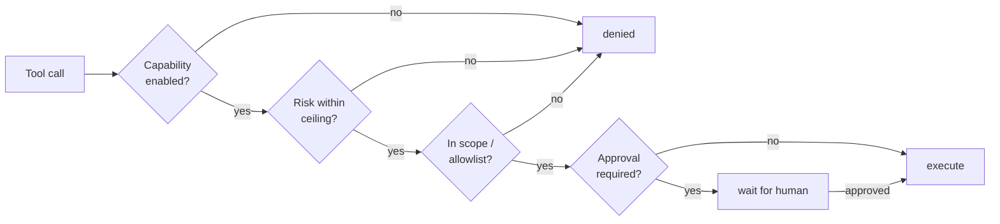

# Capabilities

What YBM can do, and what has to be switched on first. See [ARCHITECTURE.md](ARCHITECTURE.md)
for how it fits together and [THREAT_MODEL.md](THREAT_MODEL.md) before enabling anything
high-impact.

## How access works

Every tool declares a **capability**. A capability is off until you enable it, and each one has
its own risk ceiling and approval setting.

Only three capabilities ship enabled: `telegram.receive`, `telegram.send`, `llm.generate`.
**Everything else starts off** - including all filesystem, terminal, browser, desktop, and
network access.

Set access from the admin console's **Access** page, which groups capabilities into four modes:

| Mode | Means |
|---|---|
| **Off** | Tool is unavailable |
| **Read-only** | Read operations only |
| **Write with approval** | Writes allowed, each one pauses for a human |
| **Full access** | Writes allowed without per-call approval |

> "Full access" still does **not** bypass approvals that a tool declares for a specific
> operation (installing an MCP server, promoting generated code, running generated Python).
> Those are enforced by the runtime, not by the access mode. See [THREAT_MODEL.md](THREAT_MODEL.md).

## Tools

| Tool | Capability | What it does |
|---|---|---|
| `filesystem.manage` | `filesystem.write` | Inspect, search, describe, organize, and rename files inside allowed roots. Builds a manifest first, then applies only approved moves/copies. Rejects path escapes. |
| `workspace.manage` | `filesystem.write` | Per-task workspace under `.agent_control/workspaces/task_<id>`: prepare, write files, materialize a static app, serve it on localhost. |
| `document.manage` | `filesystem.write` | Inspect/extract documents, summarize PDFs, create and update PowerPoint files. |
| `adapter.factory` | `filesystem.write` | Scaffolds a reviewable adapter proposal when a needed tool doesn't exist. Never auto-loaded. |
| `code.interpreter` | `terminal.run` | Run or generate-and-run Python. Local subprocess by default; optional Docker sandbox for untrusted code with network off and memory/CPU/pid limits. |
| `coding.agent` | `terminal.run` | Session-backed Codex, Claude Code, and GitHub Copilot CLI runs with durable session files and restart-safe completion. |
| `mcp.client` | `terminal.run` | Discover, health-check, and call configured external MCP servers. Can install a new stdio server config. |
| `browser.open` | `browser.open` | Open URLs, search, summarize pages, inspect tabs, screenshot. |
| `browser.control` | `browser.control` | Navigate, click, fill forms, close tabs. |
| `computer.use` | `desktop.control` | Windows-only. `observe` returns a screenshot plus UI tree; `run_goal` runs a bounded mouse/keyboard loop. |
| `vscode.copilot_terminal` | `vscode.write_files` | Queue a Copilot prompt into the VS Code terminal, with a local Copilot CLI fallback. |
| `vscode.terminal_command` | `vscode.write_files` | Queue a shell command into the VS Code terminal. |
| `http.request` | `network.http` | Call allowlisted HTTP APIs, injecting vault secrets at call time without logging them. |
| `schedule.manage` | `schedule.manage` | Create, list, pause, resume, delete, and run recurring schedules. |
| `memory.manage` | `memory.manage` | Remember, list, and forget structured facts. |
| `tts.synthesize` | `tts.synthesize` | Text to speech. |
| `artifact.deliver` | `telegram.send` | Send a generated file or screenshot back to the chat. |
| `knowledge.search` | `telegram.receive` | Keyword-overlap search across a folder of your documents. Not embeddings. |
| `persona.manage` | `telegram.receive` | Read/update the global preference document injected into every Operator prompt. |
| `skills.use` | `telegram.receive` | List and load user-droppable skill instructions. |
| `task.status` | `telegram.receive` | Active tasks, background sessions, and what's waiting on approval or external work. |

## Channels

| | Telegram | WhatsApp | Web chat |
|---|---|---|---|
| Default | on (needs token) | **off** | on |
| Setup | BotFather token + allowlist | QR link a number | none |
| Text | ✅ | ✅ | ✅ |
| Slash commands | ✅ | ❌ | ❌ |
| Inline approve/reject buttons | ✅ | ❌ | ❌ |
| Voice transcription | ✅ | ❌ | ✅ |
| File / screenshot delivery | ✅ | ❌ | ❌ |

Plain-text `approve`, `status`, and `remember that ...` work on every channel.

## Not implemented

- Direct GitHub Copilot **Chat panel** capture - no stable public API exists. Copilot routing
  goes through the VS Code terminal or the CLI fallback instead.
- Persistent editable config for every advanced adapter field.
- A single unified process supervisor: Windows `scripts\ybm.ps1` and the cross-platform `ybm`
  command are both complete, but they're two implementations.

## Platform limits

- **Desktop screenshot/control is Windows-only.** Everything else - filesystem, browser, code
  interpreter, MCP, scheduling, coding agents, web chat - runs on Linux, Windows, and macOS in CI.
- `scripts\ybm.ps1` is Windows-only; other platforms use the `ybm` command.
- `browser.*` sees only Chrome tabs on the configured DevTools debugging port (default `9222`).
  Ordinary Chrome windows launched without it are invisible to the adapter.
- `computer.use run_goal` needs a local model endpoint that accepts OpenAI-compatible image
  payloads. Without one, observation still works but action planning fails loudly.
- VS Code terminal stdout capture needs VS Code shell integration; without it the bridge records
  dispatch only.
- WhatsApp's privacy-preserving **LID** addressing hides some senders' real numbers, and there's
  no way to resolve one back. Those senders can never match `allowed_numbers`; the audit trail
  labels this `lid_jid_no_resolvable_number` so it doesn't read as a config mistake.
