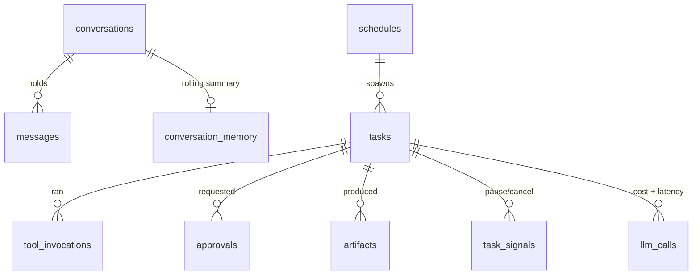

# Database Inspection

Storage is a single SQLite file — durable, easy to back up, and inspectable without running
another service.

Default path: `agent_control.db`

## Inspect

```powershell
.\scripts\ybm.ps1 db inspect     # Windows: row counts + task status breakdown
```
```bash
ybm db-inspect                   # cross-platform equivalent
ybm db-clean --days 30           # prune tasks + child records older than N days
ybm db-reset --yes               # wipe everything
```

The admin API exposes the same summary at `GET /admin/api/database/summary` (path, table counts,
recent activity).

## Tables



| Table | Contents |
|---|---|
| `tasks` | Objective, status, metadata (`operator_history`, budgets, `synthesized_answer`) |
| `tool_invocations` | Every tool request and its result |
| `approvals` | Pending and decided approval requests |
| `approval_grants` | "Allow for this task" grants |
| `audit_events` | Policy decisions, classifications, access checks, failures — redacted |
| `llm_calls` | Per-call tokens, cost, and latency |
| `messages` | Normalized inbound messages |
| `conversations` | One per chat/channel |
| `conversation_memory` | Rolling per-chat summary |
| `artifacts` | Files produced by tasks |
| `schedules` | Recurring job definitions |
| `memory_facts` | Structured facts with category, confidence, provenance |
| `task_signals` | Pause/cancel/resume signals |

Start with `tasks`, `tool_invocations`, and `audit_events` — that trio explains almost any run.
For a single task, `ybm trace-task <task_id>` is faster than reading tables by hand.

## Browse in VS Code

Install `qwtel.sqlite-viewer` (VS Code suggests it from `.vscode/extensions.json`), then open
`agent_control.db` directly.
