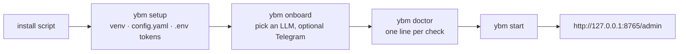

# Local Setup

## Fastest path

```bash
# Linux/macOS
curl -fsSL https://raw.githubusercontent.com/iodriller/YBM/main/scripts/install.sh | sh
```
```powershell
# Windows
iwr https://raw.githubusercontent.com/iodriller/YBM/main/scripts/install.ps1 -UseBasicParsing | iex
```

Clones the repo, installs dependencies via `uv`, and runs `ybm onboard`. Already cloned? Run the
same script from inside the repo and it skips to setup.



After that, `YBM.bat` (double-click) or `ybm start` is all you need.

## Two interfaces, both supported

| | Cross-platform | Windows |
|---|---|---|
| Command | `ybm` (from `backend/.venv`) | `scripts\ybm.ps1` |
| Style | hyphenated: `ybm trace-task <id>` | two-word: `.\scripts\ybm.ps1 trace <id>` |

Day to day:

```bash
ybm start            # start the stack
ybm status           # what's running
ybm logs worker -f   # follow one service
ybm doctor           # check the environment
ybm stop             # stop everything
```

## Manual setup

### 1. Install

```powershell
.\scripts\ybm.ps1 setup
```

Creates `backend\.venv`, installs dependencies, copies `config/config.example.yaml` to
`config/config.yaml` if missing, and generates `AGENT_ADMIN_TOKEN` + `AGENT_SECRET_VAULT_KEY`
into `.env`. Add `--telegram-token <token>` to save the bot token at the same time.

### 2. Point at an LLM

Either add a local [LocalDeploy](https://github.com/iodriller/LocalDeploy) checkout to `.env`:

```powershell
YBM_LOCALDEPLOY_ROOT=C:\path\to\LocalDeploy
```

…or point `llm.profiles` in `config/config.yaml` at any OpenAI-compatible endpoint.

Optional, for the VS Code bridge: `VSCODE_BRIDGE_TOKEN=...`

### 3. Enable what you need

Everything invasive starts **off**. Turn capabilities on from the admin console's Access page, or:

```powershell
.\scripts\ybm.ps1 config set <dotted.path> <value>
```

See [CAPABILITIES.md](CAPABILITIES.md) for what each capability unlocks.

### 4. Check and start

```powershell
.\scripts\ybm.ps1 doctor    # Python, deps, config, DB, LLM, tokens, ports
.\scripts\ybm.ps1 start     # runs doctor first; -SkipDoctor to skip
```

`start` launches LocalDeploy, backend, Telegram polling, WhatsApp polling, worker, scheduler, and
the coding-session watcher. Skip any with `-NoTelegram`, `-NoWhatsApp`, `-NoWorker`,
`-NoScheduler`, `-NoLocalDeploy`. The admin console is served by the backend, not a separate
process.

Open **http://127.0.0.1:8765/admin**. If the React console hasn't been built at this checkout
(`ybm ui-build`), you get a pointer page instead — the JSON API under `/admin/api/*` works either way.

### 5. Link WhatsApp (optional)

WhatsApp is off by default and uses [Baileys](https://github.com/WhiskeySockets/Baileys), an
unofficial WhatsApp Web client — no Meta developer account or public webhook, just a phone you
link as a device. `ybm setup` installs the sidecar's dependencies if Node.js 20+ is on `PATH`.

1. Set `channels.whatsapp.enabled: true` in `config/config.yaml`.
2. Restart: `.\scripts\ybm.ps1 start`
3. Watch for the QR code: `.\scripts\ybm.ps1 logs whatsapp -Follow`
4. Scan it (phone → Settings → Linked Devices). The session persists in `.agent_control/whatsapp_auth/`.
5. Add the number to `channels.whatsapp.allowed_numbers` — E.164 digits, no `+`
   (e.g. `"15551234567"`). **An empty list denies everything.** Restart to apply.

> Consider linking a secondary number. Baileys is unofficial, so there's a small
> account-flagging risk. Never commit a real number to a shared checkout.

## Daily commands

```powershell
.\scripts\ybm.ps1 status
.\scripts\ybm.ps1 logs worker -Follow
.\scripts\ybm.ps1 stop
.\scripts\ybm.ps1 test
Invoke-RestMethod http://127.0.0.1:8765/health
```

Package the VS Code extension: `.\scripts\package_vscode_extension.ps1`

The per-service launchers under `scripts/services/` are what `start` actually runs — use them
directly only to debug one process in isolation.

## Where things land

| Path | Contents |
|---|---|
| `.agent_control/workspaces/task_<id>` | Per-task generated files |
| `.agent_control/logs/<service>.jsonl` | Structured logs, secrets redacted |
| `.agent_control/browser/screenshots` | Browser screenshots |
| `.agent_control/computer_use/screenshots` | Desktop screenshots |
| `.agent_control/coding_sessions` | Codex / Claude Code / Copilot session state |
| `.agent_control/adapters` | Generated adapter proposals (never auto-loaded) |
| `agent_control.db` | SQLite database — see [DATABASE_INSPECTION.md](DATABASE_INSPECTION.md) |

Keep all of it private — see [THREAT_MODEL.md](THREAT_MODEL.md).
