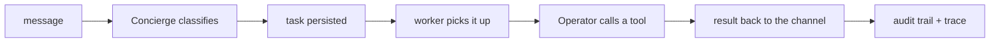

# Minimal End-To-End Test

Proves the whole chain is connected: intake → classification → persistence → worker → tool
execution → audit trail → result delivered.



## A. Web chat only (fastest — no Telegram)

Prerequisites: `ybm setup` has run once, and an LLM endpoint is reachable.

1. **Start:** `.\scripts\ybm.ps1 start`
2. **Open** http://127.0.0.1:8765/admin → **Chat**
3. **Verify the LLM** — Settings → Orchestrator LLM → **Test**. This must pass; all text is
   classified by it.
4. **Ask a question:** `what can you do?` → answers directly, no task created.
5. **Give it a task:** `what tasks are running right now?` → creates a task that calls
   `task.status` and replies.
6. **Confirm:**
   - Tasks page shows the task reaching `completed`
   - `ybm trace-task <task_id>` lists the tool call and its result
   - Audit page shows the classification and task-created events

That exercises every layer except channel-specific intake.

## B. Telegram (adds real channel intake)

Extra prerequisites: a BotFather token, plus your Telegram user ID and chat ID.

1. **Add the token** to `.env`:
   ```powershell
   TELEGRAM_BOT_TOKEN=your_bot_token_here
   ```
2. **Configure** the Telegram panel in the admin console — Enabled ✅, Token Env
   `TELEGRAM_BOT_TOKEN`, your user ID and chat ID, Polling ✅ — and **Save**.
   > An empty allowlist denies every message.
3. **Restart:** `.\scripts\ybm.ps1 start`
4. **Send** `what tasks are running right now?` to your bot, then `/tasks`.
5. **Confirm:** `/tasks` lists it, the reply comes back to the same chat, and the Tasks page shows
   it completing.

## C. File-producing task (optional, needs filesystem write)

Requires **File system** access. With `filesystem.write` enabled, send:

```text
create a hello world web app and launch it
```

Expect a localhost preview URL plus files under `.agent_control/workspaces/task_<id>`.

> The Operator decides its own tool sequence each run — there is no fixed plan template, so the
> exact steps vary. Judge the result, not the route.

## Check from the API

```powershell
Invoke-RestMethod http://127.0.0.1:8765/admin/api/summary | ConvertTo-Json -Depth 8
```

Look for `tasks[0].objective`, `integrations.telegram.enabled`, and
`integrations.telegram.token_present`.

## Stop

```powershell
.\scripts\ybm.ps1 stop
```

## If it stalls

| Symptom | Check |
|---|---|
| Message ignored | Allowlist — an empty one denies everything |
| Task stuck `received` | Is the worker running? `ybm status` |
| Task `awaiting_approval` | Approve it in the console, or on Telegram |
| Tool "denied" | Capability is off — see [CAPABILITIES.md](CAPABILITIES.md) |
| Anything else | `ybm trace-task <task_id>` and `ybm logs worker -f` |
