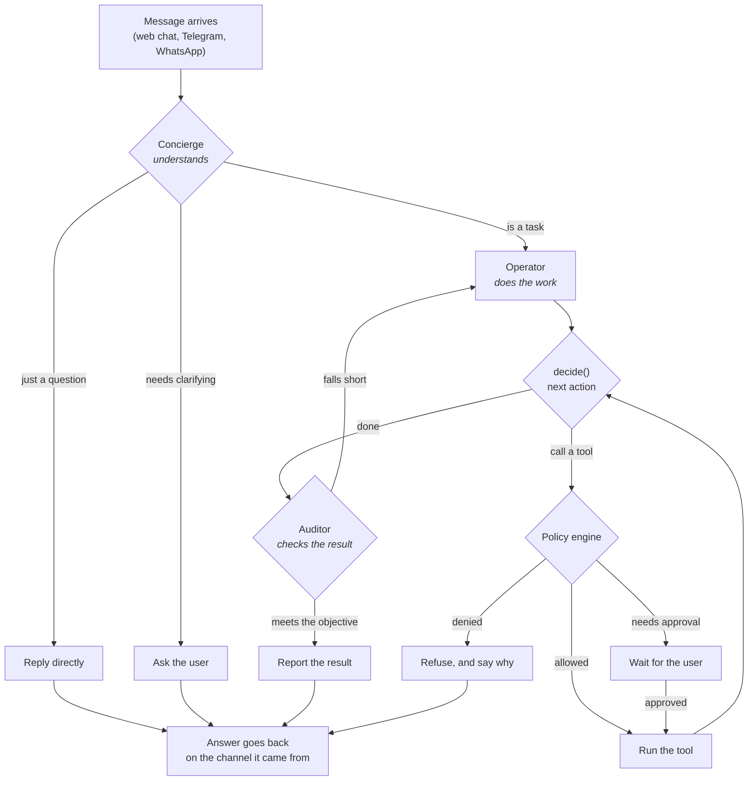
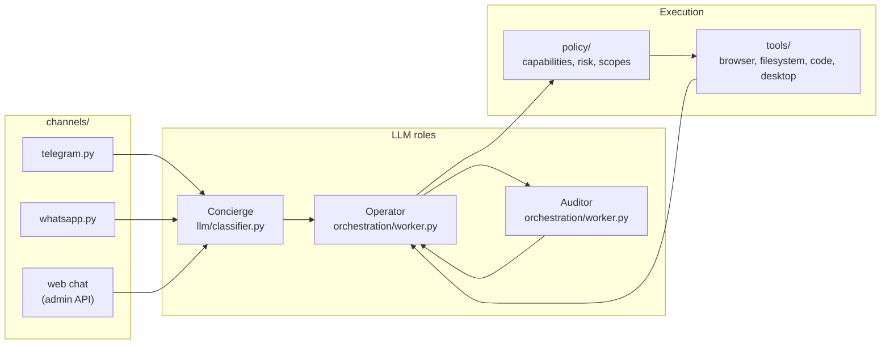

# Concierge, Operator, Auditor

The three LLM roles a request passes through. The names stay as they are -
they are woven through `schemas.py` (`OperatorDecision`, `OperatorAction`) and
the recorded scenario fixtures depend on them. What changed is the *user-facing*
wording: the console no longer names them at a first-time user, and says
"understand requests, do the work, and check the result" instead.

This document is for people reading the code. The mapping:

| Role | User-facing phrasing | What it owns |
|---|---|---|
| **Concierge** | *understands requests* | Classifies the incoming message, asks for clarification, and composes the chat reply |
| **Operator** | *does the work* | The tool-calling loop: decides the next action, runs it under policy, repeats |
| **Auditor** | *checks the result* | Verifies the work against the objective before it is reported as done |

## The path a request takes

The loop between Operator and Auditor is the important part: the Auditor can
send work back, which is why a task can run several rounds before it reports.
Retries are bounded - see `orchestration/worker.py`.

## Where each one lives

All three roles share one model profile by default. `llm/config` supports a
separate `major_profile` for heavier work and a `fallback_profile` used when
the primary endpoint is unreachable - connection errors, timeouts, or HTTP 5xx
only. A 4xx or a bad structured response is *not* failed over, because it would
fail the same way against the fallback and switching models would hide the real
problem (`llm/providers.py::_is_unavailability`).

## Why the names are not being changed

Renaming would touch `OperatorDecision`, `OperatorAction`, and the schema
fields the sixteen recorded scenario fixtures assert against. That is a large,
risky diff whose entire benefit - a first-time user not meeting internal
jargon - is already delivered by changing the words in the console.

If a short user-facing name is ever needed for a diagram, the suggestion on
file is **Intake / Runner / Reviewer**.
