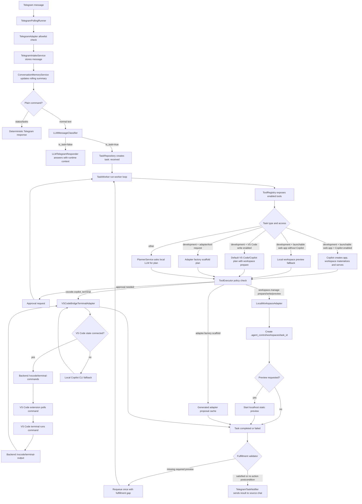

# Telegram To Worker Flow

## Diagram



## Task Types Today

The classifier writes these task types from `TaskType`:

- `development`
- `configuration`
- `admin_control`
- `desktop_observation`
- `question`
- `status_request`
- `other`

Only messages classified with `is_task=true` become persisted tasks.

## Current Pickup Rules

Tasks are created with status `received`. They are picked up only by:

```powershell
.\scripts\start_stack.ps1
```

The stack script starts the worker. For debugging, `.\scripts\run_worker.ps1` starts only the worker.

The worker processes `received`, `interpreting`, `planned`, `awaiting_approval`, `running`, and `retrying` tasks. It skips `paused`, `cancelled`, `completed`, `failed`, and `blocked` tasks unless a control action changes their status.

## VS Code And Copilot Notes

The implemented minimal bridge path queues a command into the VS Code integrated terminal and waits for a matching terminal-output record. If no VS Code state is connected, the adapter falls back to running the local Copilot CLI directly and still reports the captured output.

For general development tasks, the deterministic plan first prepares a task workspace when `filesystem.write` is enabled, then passes that workspace as `cwd` to the VS Code/Copilot step.

By default, the Copilot fallback uses:

```text
gh copilot -p '<task prompt>'
```

This requires GitHub CLI Copilot to be installed and authenticated if you want actual Copilot output. VS Code terminal output capture requires VS Code shell integration; without shell integration, the extension records a final dispatch message instead of command stdout.

The remaining gap is direct GitHub Copilot Chat response capture inside VS Code. The public bridge here can open/run terminal commands, but it does not have a stable public API for reading Copilot Chat answers from the chat panel.

## Conversation Memory Notes

Conversation memory is stored in `conversation_memory` as:

- a compact LLM-updated summary
- a bounded recent-turn list
- update metadata

The summarizer uses the active local LLM provider and receives only the previous memory plus the recent-turn window. If the LLM fails or times out, it falls back to a deterministic rolling summary. This avoids sending the full Telegram conversation back into the local model.

## Local Workspace Notes

Every development task can get a dedicated workspace when `filesystem.write` is enabled. The default root is:

```text
.agent_control/workspaces/task_<id>
```

The `workspace.manage` tool supports these operations:

- `prepare`: create the task workspace and `TASK.md`
- `write_files`: write validated relative file paths inside that workspace
- `materialize_static_app`: ensure a static app exists by using Copilot output code blocks or existing workspace files
- `launch_static`: serve the workspace over localhost
- `web_app_preview`: write a minimal web app and serve it

Launchable web-app requests use Copilot as the primary creator when `vscode.write_files` is enabled. The worker prepares a workspace, asks Copilot to create files there, materializes Copilot code-block output if direct writes were unavailable, then serves the workspace and returns the preview URL to Telegram and the admin task row. If Copilot is disabled, the workspace preview fallback still produces a visible app. The workspace root, host, starting port, and browser-open behavior are configurable in the admin UI under **Local Workspace** or in `config/config.yaml`.

## Tool Registry And Current Gaps

Worker tools are registered through `backend/src/agent_control/tools/registry.py`. That registry is the single place that maps enabled adapters to tool names and summarizes tool capabilities for the planner.

Implemented streams:

- `workspace.manage`: task workspaces, file writes inside the workspace, static preview launch.
- `adapter.factory`: scaffold generated adapter proposals under `.agent_control/adapters` for review and later promotion.
- `vscode.copilot_terminal`: VS Code terminal dispatch or local Copilot CLI fallback.
- `vscode.terminal_command`: explicit VS Code terminal command dispatch.
- `coding_assistant`: configured terminal assistant command.
- `desktop.screenshot`: Telegram screenshot command path.

The registry exposes a capability-vault summary to the planner, and the Telegram responder includes the same key capability signals in its concise runtime context. Missing tools should be handled by routing to `adapter.factory` for a scaffolded proposal, not by inventing unregistered runtime tool names. Generated adapters are cache artifacts only; they are not imported or executed until reviewed, tested, and registered.

Known gaps to address next:

- Browser open/control has capabilities but no registered adapter yet.
- General file organization outside task workspaces needs a scoped filesystem adapter with allowlisted roots.
- Desktop control exists as a capability but has no registered adapter.
- Planner output is still free-form `PlanStep` JSON; tool inputs are not yet validated per tool operation schema.
- Fulfillment validation currently covers visible app preview URLs. More action types need explicit postconditions.

## Config And Env Strategy

`config/config.yaml` is the source of truth for non-secret runtime configuration: profiles, enabled adapters, access modes, allowlists, workspace paths, ports, and model selection.

`.env` is reserved for secrets and externally supplied values such as:

- `TELEGRAM_BOT_TOKEN`
- `OPENAI_API_KEY`
- `VSCODE_BRIDGE_TOKEN`
- `AGENT_ADMIN_TOKEN`

Admin config writes update YAML for non-secrets and write only provided secret values to `.env`. This avoids YAML/env drift where an old env override silently wins over the admin UI.
