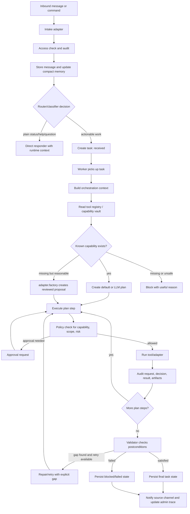
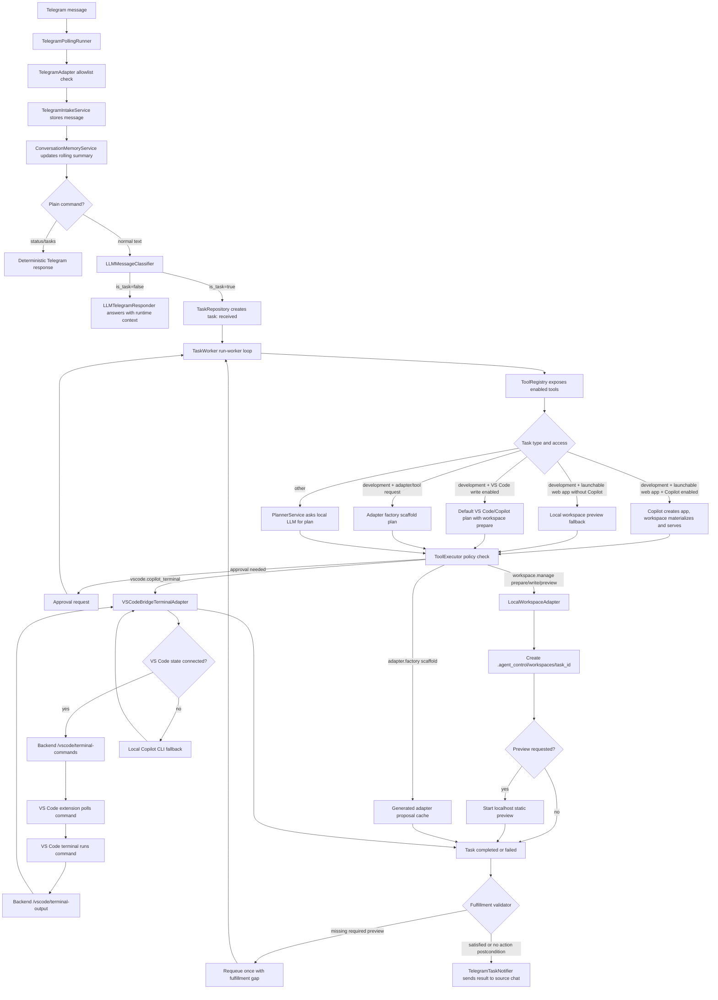

# Telegram To Worker Flow

## Universal Workflow

This is the intended workflow for every channel and every task type. Telegram is only one intake channel.



Simple step version:

1. An intake adapter receives the message, checks whether the sender is allowed, stores the message, and updates compact conversation memory.
2. The classifier/router decides whether this is a direct response, a status/help request, or a persisted task.
3. For tasks, the worker builds orchestration context from the task, memory, config, and the tool registry/capability vault.
4. The planner chooses registered tools by exact tool name. For common flows, deterministic default plans are preferred; otherwise the local LLM planner can create a structured plan.
5. Missing capabilities should route to `adapter.factory` for a proposal, not dynamically import unreviewed runtime code.
6. Every executable step goes through policy before the tool runs.
7. Every request, policy decision, tool result, state transition, and important artifact is audited so the admin trace can reconstruct the flow.
8. A validator checks the outcome against the task postconditions. For visible app tasks this means a workspace and preview URL; other task types need typed postconditions.
9. The final result, workspace path, preview URL, errors, and usage details are sent back to the source channel and shown in the admin UI.

## Audit Example: Hamster App

I checked the live audit trace for `task_bd26e132de50433aadaf2678ea4db2f4`, objective `Create me a app for hamsters and launch it`.

What happened:

- `message_received`: Telegram stored the raw message.
- `message_classified`: the classifier marked it as a `development` task. The local LLM returned an invalid response, so the classifier used the actionable-task heuristic fallback.
- `task_created`: a persisted task was created with source Telegram metadata.
- `plan_created`: the worker used `default_vscode_development_plan`. The plan context included the registry/capability vault: `workspace.manage`, `adapter.factory`, `vscode.copilot_terminal`, `vscode.terminal_command`, `desktop.screenshot`, plus known gaps like browser control.
- Plan steps were: prepare workspace, ask Copilot, materialize Copilot app files, launch static preview.
- For each step, the trace shows `tool_requested`, then `policy_decision`, then `tool_completed`.
- Copilot could not write files directly because permission was denied in that path, but it returned fenced file code blocks. `workspace.manage` then materialized those into the task workspace.
- `launch_static` started a local preview at `http://127.0.0.1:8890/`.
- The task moved from `running` to `completed`, and task metadata recorded `workspace_dir`, `preview_url`, Copilot usage lines, and `notified_statuses`.

## Recommendation

The steps above are all useful, but the implementation should stay organized into four phases:

- Intake: access, storage, memory, classification.
- Planning: registry/vault context, deterministic or LLM plan, adapter proposal when missing.
- Execution: policy, tool run, audit, artifacts.
- Closure: validation, retry/repair, notification.

Do not add a separate vault lookup before every subtask unless a plan is stale or a tool fails as unavailable. The registry/vault context should be captured once during planning, then execution should trust the plan and fail clearly if a tool disappears or a schema no longer matches.

The concrete implementation strategy is:

1. Keep the registry as the source of truth for executable tools, known gaps, supported operations, and typed input contracts.
2. Validate tool input before policy evaluation and before adapter execution, so a malformed plan fails as `validation_failed` instead of silently doing the wrong thing.
3. Put typed postconditions on plans for action requests. Examples: `preview_url`, `workspace_dir`, and `adapter_proposal`.
4. Let deterministic plans declare postconditions directly. Let LLM plans declare them too, but keep objective/plan-step inference as a fallback for older plans.
5. Validate postconditions only at closure, after the final step, so the worker does not waste time checking the vault before every subtask.
6. If a required postcondition is missing, requeue once with the explicit gap in metadata. If the same gap remains, block the task with a useful reason.

Implemented now:

- `ToolDefinition` carries operation/input schemas for registered tools.
- `ToolExecutor` validates registered tool input before policy and adapter calls.
- `PlanModel` supports typed `postconditions`.
- Default web-app and adapter-factory plans declare their expected postconditions.
- The fulfillment validator checks explicit plan postconditions first and falls back to task/plan inference.
- Admin traces surface plan postconditions in the timeline details.

Recommended next hardening:

- Add output schemas per tool operation, not just input schemas.
- Add more postcondition types for browser state, desktop observation, file organization, GitHub PRs, and external command completion.
- Validate LLM-generated plan steps against the registry before persisting the plan, so invalid plans are repaired before they enter the worker loop.

## Diagram



## Task Types Today

The classifier writes these task types from `TaskType`:

- `development`
- `configuration`
- `admin_control`
- `desktop_observation`
- `question`
- `status_request`
- `other`

Only messages classified with `is_task=true` become persisted tasks.

## Current Pickup Rules

Tasks are created with status `received`. They are picked up only by:

```powershell
.\scripts\start_stack.ps1
```

The stack script starts the worker. For debugging, `.\scripts\run_worker.ps1` starts only the worker.

The worker processes `received`, `interpreting`, `planned`, `awaiting_approval`, `running`, and `retrying` tasks. It skips `paused`, `cancelled`, `completed`, `failed`, and `blocked` tasks unless a control action changes their status.

## VS Code And Copilot Notes

The implemented minimal bridge path queues a command into the VS Code integrated terminal and waits for a matching terminal-output record. If no VS Code state is connected, the adapter falls back to running the local Copilot CLI directly and still reports the captured output.

For general development tasks, the deterministic plan first prepares a task workspace when `filesystem.write` is enabled, then passes that workspace as `cwd` to the VS Code/Copilot step.

By default, the Copilot fallback uses:

```text
gh copilot -p '<task prompt>'
```

This requires GitHub CLI Copilot to be installed and authenticated if you want actual Copilot output. VS Code terminal output capture requires VS Code shell integration; without shell integration, the extension records a final dispatch message instead of command stdout.

The remaining gap is direct GitHub Copilot Chat response capture inside VS Code. The public bridge here can open/run terminal commands, but it does not have a stable public API for reading Copilot Chat answers from the chat panel.

## Conversation Memory Notes

Conversation memory is stored in `conversation_memory` as:

- a compact LLM-updated summary
- a bounded recent-turn list
- update metadata

The summarizer uses the active local LLM provider and receives only the previous memory plus the recent-turn window. If the LLM fails or times out, it falls back to a deterministic rolling summary. This avoids sending the full Telegram conversation back into the local model.

## Local Workspace Notes

Every development task can get a dedicated workspace when `filesystem.write` is enabled. The default root is:

```text
.agent_control/workspaces/task_<id>
```

The `workspace.manage` tool supports these operations:

- `prepare`: create the task workspace and `TASK.md`
- `write_files`: write validated relative file paths inside that workspace
- `materialize_static_app`: ensure a static app exists by using Copilot output code blocks or existing workspace files
- `launch_static`: serve the workspace over localhost
- `web_app_preview`: write a minimal web app and serve it

Launchable web-app requests use Copilot as the primary creator when `vscode.write_files` is enabled. The worker prepares a workspace, asks Copilot to create files there, materializes Copilot code-block output if direct writes were unavailable, then serves the workspace and returns the preview URL to Telegram and the admin task row. If Copilot is disabled, the workspace preview fallback still produces a visible app. The workspace root, host, starting port, and browser-open behavior are configurable in the admin UI under **Local Workspace** or in `config/config.yaml`.

## Tool Registry And Current Gaps

Worker tools are registered through `backend/src/agent_control/tools/registry.py`. That registry is the single place that maps enabled adapters to tool names and summarizes tool capabilities for the planner.

Implemented streams:

- `workspace.manage`: task workspaces, file writes inside the workspace, static preview launch.
- `adapter.factory`: scaffold generated adapter proposals under `.agent_control/adapters` for review and later promotion.
- `vscode.copilot_terminal`: VS Code terminal dispatch or local Copilot CLI fallback.
- `vscode.terminal_command`: explicit VS Code terminal command dispatch.
- `coding_assistant`: configured terminal assistant command.
- `desktop.screenshot`: Telegram screenshot command path.

The registry exposes a capability-vault summary to the planner, and the Telegram responder includes the same key capability signals in its concise runtime context. Missing tools should be handled by routing to `adapter.factory` for a scaffolded proposal, not by inventing unregistered runtime tool names. Generated adapters are cache artifacts only; they are not imported or executed until reviewed, tested, and registered.

Registered tools also expose typed input contracts. The worker validates those contracts before policy and adapter execution. This gives failures like `validation_failed` for malformed tool input instead of letting a tool no-op or interpret a bad payload loosely.

Known gaps to address next:

- Browser open/control has capabilities but no registered adapter yet.
- General file organization outside task workspaces needs a scoped filesystem adapter with allowlisted roots.
- Desktop control exists as a capability but has no registered adapter.
- Tool output is not yet validated against typed output schemas.
- More action types need explicit postconditions beyond workspace, preview URL, and adapter proposal.
- LLM-generated plans are validated when their tools execute; they are not yet repaired at plan persistence time using registry schemas.

## Config And Env Strategy

`config/config.yaml` is the source of truth for non-secret runtime configuration: profiles, enabled adapters, access modes, allowlists, workspace paths, ports, and model selection.

`.env` is reserved for secrets and externally supplied values such as:

- `TELEGRAM_BOT_TOKEN`
- `OPENAI_API_KEY`
- `VSCODE_BRIDGE_TOKEN`
- `AGENT_ADMIN_TOKEN`

Admin config writes update YAML for non-secrets and write only provided secret values to `.env`. This avoids YAML/env drift where an old env override silently wins over the admin UI.
