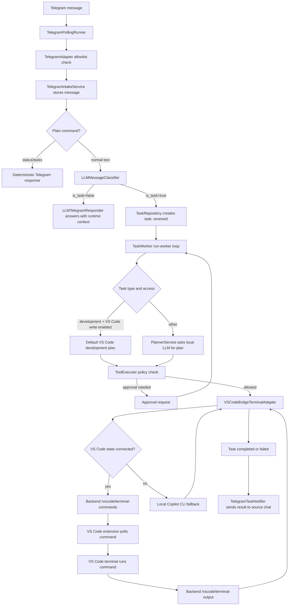

# Telegram To Worker Flow

## Diagram



## Task Types Today

The classifier writes these task types from `TaskType`:

- `development`
- `configuration`
- `admin_control`
- `desktop_observation`
- `question`
- `status_request`
- `other`

Only messages classified with `is_task=true` become persisted tasks.

## Current Pickup Rules

Tasks are created with status `received`. They are picked up only by:

```powershell
.\scripts\start_stack.ps1
```

The stack script starts the worker. For debugging, `.\scripts\run_worker.ps1` starts only the worker.

The worker processes `received`, `interpreting`, `planned`, `awaiting_approval`, `running`, and `retrying` tasks. It skips `paused`, `cancelled`, `completed`, `failed`, and `blocked` tasks unless a control action changes their status.

## VS Code And Copilot Notes

The implemented minimal bridge path queues a command into the VS Code integrated terminal and waits for a matching terminal-output record. If no VS Code state is connected, the adapter falls back to running the local Copilot CLI directly and still reports the captured output. By default, the deterministic development plan uses:

```text
gh copilot -p '<task prompt>'
```

This requires GitHub CLI Copilot to be installed and authenticated if you want actual Copilot output. VS Code terminal output capture requires VS Code shell integration; without shell integration, the extension records a final dispatch message instead of command stdout.

The remaining gap is direct GitHub Copilot Chat response capture inside VS Code. The public bridge here can open/run terminal commands, but it does not have a stable public API for reading Copilot Chat answers from the chat panel.
